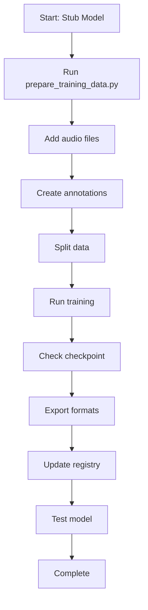
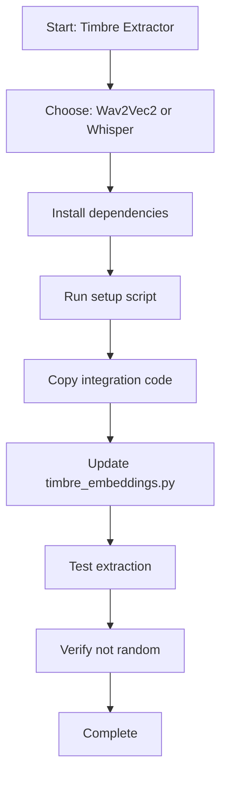
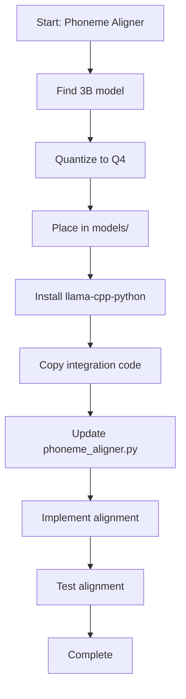

# Model Workflow Guide

Visual workflow and decision tree for model management tasks.

## Workflow Overview

```
┌─────────────────────────────────────────────────────────────┐
│                    MODEL MANAGEMENT                         │
└─────────────────────────────────────────────────────────────┘
                            │
                            ▼
        ┌───────────────────────────────────┐
        │  What do you want to do?          │
        └───────────────────────────────────┘
                            │
        ┌───────────────────┼───────────────────┐
        │                   │                   │
        ▼                   ▼                   ▼
   [Check Status]    [Train Model]      [Integrate Model]
        │                   │                   │
        │                   │                   │
        ▼                   ▼                   ▼
   verify_models.py   prepare_data.py   integration_guide
   test_models.py     train script      example_code
```

## Decision Tree

### Starting Point: Check Current Status

```
python scripts/verify_models.py
                    │
        ┌───────────┼───────────┐
        │           │           │
        ▼           ▼           ▼
    [All OK]   [Stub Models] [Missing Models]
        │           │           │
        │           │           │
     Done      Need Training  Need Integration
```

### If You Have Stub Models

```
Stub Model Detected
        │
        ▼
┌───────────────────────┐
│ Choose Model:         │
│ 1. instrumentrecognizer│
│ 2. emotionnodeclassifier│
└───────────────────────┘
        │
        ▼
┌───────────────────────┐
│ Prepare Dataset       │
│ python scripts/       │
│   prepare_training_   │
│   data.py --dataset   │
└───────────────────────┘
        │
        ▼
┌───────────────────────┐
│ Add Data              │
│ - Audio files         │
│ - Annotations         │
│ - Split train/val/test│
└───────────────────────┘
        │
        ▼
┌───────────────────────┐
│ Train Model           │
│ python train_         │
│   integrated.py       │
│   --model <name>      │
│   --config <config>   │
└───────────────────────┘
        │
        ▼
┌───────────────────────┐
│ Verify & Test         │
│ python scripts/       │
│   verify_models.py    │
│ python scripts/       │
│   test_models.py      │
└───────────────────────┘
```

### If You Have Missing Models

```
Missing Model Detected
        │
        ▼
┌───────────────────────┐
│ Choose Model:         │
│ 1. phoneme_aligner    │
│ 2. timbre_extractor   │
└───────────────────────┘
        │
        ├─────────────────┐
        │                 │
        ▼                 ▼
┌──────────────┐   ┌──────────────┐
│ Phoneme      │   │ Timbre       │
│ Aligner      │   │ Extractor    │
└──────────────┘   └──────────────┘
        │                 │
        ▼                 ▼
┌──────────────┐   ┌──────────────┐
│ Read:        │   │ Read:        │
│ PHONEME_     │   │ TIMBRE_      │
│ ALIGNER_     │   │ EXTRACTOR_   │
│ INTEGRATION  │   │ INTEGRATION  │
└──────────────┘   └──────────────┘
        │                 │
        ▼                 ▼
┌──────────────┐   ┌──────────────┐
│ Obtain Model │   │ Choose:      │
│ - Find 3B Q4 │   │ - Wav2Vec2   │
│ - Quantize   │   │ - Whisper    │
└──────────────┘   └──────────────┘
        │                 │
        ▼                 ▼
┌──────────────┐   ┌──────────────┐
│ Install Deps │   │ Install Deps │
│ llama-cpp-   │   │ transformers │
│ python       │   │ torchaudio   │
└──────────────┘   └──────────────┘
        │                 │
        ▼                 ▼
┌──────────────┐   ┌──────────────┐
│ Copy Code    │   │ Copy Code    │
│ from example │   │ from example │
│ file         │   │ file         │
└──────────────┘   └──────────────┘
        │                 │
        ▼                 ▼
┌──────────────┐   ┌──────────────┐
│ Update       │   │ Update       │
│ phoneme_     │   │ timbre_      │
│ aligner.py   │   │ embeddings.py│
└──────────────┘   └──────────────┘
        │                 │
        └─────────┬───────┘
                  │
                  ▼
         ┌────────────────┐
         │ Test           │
         │ python scripts/│
         │   test_models.py│
         └────────────────┘
```

## Step-by-Step Workflows

### Workflow 1: Training a Stub Model



### Workflow 2: Integrating Timbre Extractor



### Workflow 3: Integrating Phoneme Aligner



## Quick Reference Workflows

### Daily Operations

```
Check Status → Verify Models → Test Models → Done
```

### New Model Training

```
Prepare Data → Train → Export → Register → Test → Done
```

### Model Integration

```
Read Guide → Install Deps → Copy Code → Update File → Test → Done
```

## Troubleshooting Workflow

```
Problem Detected
        │
        ▼
┌──────────────────┐
│ Identify Issue   │
│ - Model missing? │
│ - Import error?  │
│ - Training fail? │
└──────────────────┘
        │
        ▼
┌──────────────────┐
│ Check Docs       │
│ - Setup guide    │
│ - Integration    │
│ - Troubleshooting│
└──────────────────┘
        │
        ▼
┌──────────────────┐
│ Run Scripts      │
│ - verify_models  │
│ - test_models    │
└──────────────────┘
        │
        ▼
┌──────────────────┐
│ Fix Issue        │
│ - Install deps   │
│ - Fix code       │
│ - Retry          │
└──────────────────┘
```

## Integration Checklist Workflow

For each model integration:

1. ✅ Read integration guide
2. ✅ Install dependencies
3. ✅ Obtain/prepare model/data
4. ✅ Copy example code
5. ✅ Update implementation
6. ✅ Test functionality
7. ✅ Verify in registry
8. ✅ Update documentation

## Model Lifecycle

```
┌─────────┐
│ Planning│
└────┬────┘
     │
     ▼
┌─────────┐
│ Design  │
└────┬────┘
     │
     ▼
┌─────────┐
│ Develop │
└────┬────┘
     │
     ▼
┌─────────┐
│ Train   │
└────┬────┘
     │
     ▼
┌─────────┐
│ Test    │
└────┬────┘
     │
     ▼
┌─────────┐
│ Deploy  │
└────┬────┘
     │
     ▼
┌─────────┐
│ Monitor │
└─────────┘
```

## Best Practices

1. **Always verify first:** Run `verify_models.py` before starting
2. **Test incrementally:** Test after each major change
3. **Document changes:** Update registry and docs
4. **Use scripts:** Leverage helper scripts for common tasks
5. **Follow guides:** Use integration guides for consistency
6. **Track progress:** Use completion checklist

## See Also

- [MODEL_INVENTORY.md](MODEL_INVENTORY.md) - Complete model list
- [MODEL_SETUP_GUIDE.md](MODEL_SETUP_GUIDE.md) - Detailed setup
- [MODEL_QUICK_REFERENCE.md](MODEL_QUICK_REFERENCE.md) - Quick commands
- [MODEL_COMPLETION_CHECKLIST.md](MODEL_COMPLETION_CHECKLIST.md) - Task tracking

---

**Last Updated:** 2026-01-22
