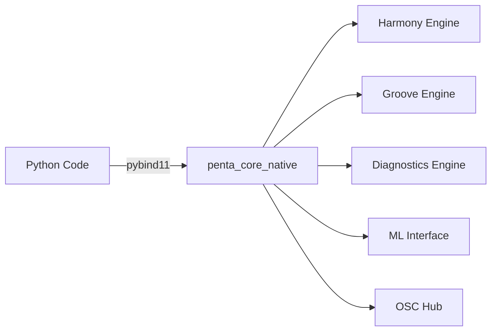

# Python/C++ Bridge API Documentation

> **Version**: 1.0.0  
> **Last Updated**: 2025-01-01

## Overview

The KmiDi project uses **pybind11** to expose C++ audio processing engines to Python. This allows real-time audio analysis (C++) to be accessible from Python-based AI workflows.

## Architecture



**Two-way communication**:
- **Python → C++**: Real-time audio analysis, ML inference requests
- **C++ → Python**: Via PythonBridge (JUCE plugins calling Python AI)

---

## Module Structure

The C++ bindings are exposed as `penta_core_native` with submodules:

```python
import penta_core_native as pcn

# Submodules
pcn.harmony      # Harmony analysis
pcn.groove       # Groove/rhythm analysis
pcn.diagnostics  # Performance diagnostics
pcn.osc          # OSC communication
pcn.ml           # ML inference interface
```

---

## Harmony Module API

### GrooveEngine

Real-time harmony analysis engine.

#### Configuration

```python
from penta_core_native import groove

config = groove.GrooveConfig()
config.sample_rate = 44100.0
config.hop_size = 512
config.min_tempo = 60.0
config.max_tempo = 180.0
config.enable_quantization = True
config.quantization_strength = 0.8
```

#### Usage

```python
import numpy as np

# Create engine
engine = groove.GrooveEngine(config)

# Process audio buffer
audio_buffer = np.array([...], dtype=np.float32)  # Mono audio
analysis = engine.process_audio(audio_buffer)

# Access results
print(f"Tempo: {analysis.current_tempo} BPM")
print(f"Confidence: {analysis.tempo_confidence}")
print(f"Onsets: {analysis.onset_positions}")
print(f"Swing: {analysis.swing}")
```

#### GrooveAnalysis Structure

```python
analysis = engine.process_audio(buffer)

# Properties:
analysis.current_tempo        # float: Detected tempo in BPM
analysis.tempo_confidence     # float: 0.0-1.0
analysis.onset_positions      # List[int]: Sample positions
analysis.onset_strengths      # List[float]: Onset strengths
analysis.time_signature_num   # int: Numerator (e.g., 4)
analysis.time_signature_den   # int: Denominator (e.g., 4)
analysis.swing               # float: Swing amount (0.0-1.0)
```

### OnsetDetector

Real-time onset detection using spectral flux.

```python
from penta_core_native import groove

config = groove.OnsetConfig()
config.sample_rate = 44100.0
config.fft_size = 2048
config.hop_size = 512
config.threshold = 0.01

detector = groove.OnsetDetector(config)

# Process audio
audio = np.array([...], dtype=np.float32)
detector.process(audio)

# Check for onset
if detector.has_onset():
    strength = detector.get_onset_strength()
    position = detector.get_onset_position()
```

### RhythmQuantizer

Quantize rhythmic events to grid.

```python
from penta_core_native import groove

quantizer = groove.RhythmQuantizer()

# Quantize onset positions
onsets = [1000, 2150, 3300]  # Sample positions
quantized = quantizer.quantize(
    onsets,
    resolution=groove.GridResolution.SIXTEENTH,
    bpm=120.0,
    sample_rate=44100.0
)
```

---

## Harmony Module API

### HarmonyEngine

Real-time chord and scale analysis.

```python
from penta_core_native import harmony

config = harmony.HarmonyConfig()
config.sample_rate = 44100.0
config.hop_size = 512

engine = harmony.HarmonyEngine(config)

# Process audio
audio = np.array([...], dtype=np.float32)
analysis = engine.process_audio(audio)

# Access results
print(f"Chord: {analysis.current_chord}")
print(f"Scale: {analysis.current_scale}")
print(f"Root: {analysis.root_note}")
print(f"Confidence: {analysis.confidence}")
```

---

## Diagnostics Module API

### DiagnosticsEngine

Real-time performance diagnostics.

```python
from penta_core_native import diagnostics

engine = diagnostics.DiagnosticsEngine()

# Process audio
audio = np.array([...], dtype=np.float32)
results = engine.process_audio(audio, sample_rate=44100.0)

# Access diagnostics
print(f"CPU usage: {results.cpu_usage}%")
print(f"Memory usage: {results.memory_usage} MB")
print(f"Latency: {results.latency_ms} ms")
```

---

## ML Module API

### MLInterface

Real-time ML inference interface.

```python
from penta_core_native import ml

# Configure
config = ml.MLConfig()
config.model_directory = "models/"

interface = ml.MLInterface(config)

# Load model registry
interface.load_registry("models/registry.json")

# Start inference thread
interface.start()

# Submit inference request
request = ml.InferenceRequest()
request.model_type = ml.ModelType.EmotionRecognizer
request.input_data = [...]  # 128 float features
request.input_size = 128
request.request_id = 1

# Run inference
result = interface.run_inference(request)

if result.success:
    output = result.output_data
    # Process output...
```

---

## OSC Module API

### OSCHub

OSC communication hub.

```python
from penta_core_native import osc

hub = osc.OSCHub()

# Start server
hub.start_server(port=8000)

# Send OSC message
hub.send_message("/test/param", 0.5, port=8001)
```

---

## Usage Examples

### Example 1: Real-time Groove Analysis

```python
import numpy as np
from penta_core_native import groove

# Setup
config = groove.GrooveConfig()
config.sample_rate = 44100.0
config.hop_size = 512
engine = groove.GrooveEngine(config)

# Process audio stream (simulated)
for frame in audio_stream:
    buffer = np.array(frame, dtype=np.float32)
    analysis = engine.process_audio(buffer)
    
    if analysis.tempo_confidence > 0.8:
        print(f"Detected tempo: {analysis.current_tempo} BPM")
```

### Example 2: Onset Detection Pipeline

```python
from penta_core_native import groove

# Create detector
config = groove.OnsetConfig()
config.sample_rate = 44100.0
detector = groove.OnsetDetector(config)

# Process audio
audio = load_audio_file("drums.wav")
onset_times = []

for i in range(0, len(audio), 512):
    frame = audio[i:i+512]
    detector.process(frame)
    
    if detector.has_onset():
        time_sec = detector.get_onset_position() / 44100.0
        onset_times.append(time_sec)

print(f"Detected {len(onset_times)} onsets")
```

### Example 3: Harmony Analysis

```python
from penta_core_native import harmony

engine = harmony.HarmonyEngine()

audio = load_audio("song.wav")
analysis = engine.process_audio(audio)

print(f"Chord: {analysis.current_chord}")
print(f"Scale: {analysis.current_scale}")
print(f"Key: {analysis.root_note}")
```

---

## Building the Bindings

### Prerequisites

- CMake 3.22+
- pybind11 (installed via pip or CMake)
- C++17 compiler

### Build Steps

```bash
mkdir build && cd build
cmake .. -DCMAKE_BUILD_TYPE=Release
cmake --build . --target penta_core_native

# Python module will be in: build/python/penta_core_native*.so
# Add to PYTHONPATH:
export PYTHONPATH=$PYTHONPATH:$(pwd)/build/python
```

### Verify Installation

```python
import penta_core_native as pcn
print(pcn.__version__)
print(dir(pcn))  # Should show: harmony, groove, diagnostics, osc, ml
```

---

## C++ → Python Bridge (PythonBridge)

JUCE plugins can call Python code via `PythonBridge`:

### C++ Side (JUCE Plugin)

```cpp
#include "PythonBridge.h"

// In plugin processor
void MyPluginProcessor::processBlock(juce::AudioBuffer<float>& buffer, 
                                     juce::MidiBuffer& midi) {
    // Call Python AI function
    auto result = pythonBridge->call_iMIDI(
        knobStates,  // Parameter values
        "generate melody in key of C"
    );
    
    // Add MIDI notes from Python result
    for (const auto& note : result.notes) {
        midi.addEvent(juce::MidiMessage::noteOn(1, note.pitch, note.velocity),
                     note.startSample);
    }
}
```

### Python Side

PythonBridge expects a function in `music_brain/`:

```python
# music_brain/plugin_callback.py
def call_iMIDI(knob_states: dict, text_prompt: str) -> dict:
    """
    Called from JUCE plugin.
    
    Args:
        knob_states: Dictionary of parameter values
        text_prompt: Text instruction from plugin
        
    Returns:
        Dictionary with 'notes' list of MIDI events
    """
    # Generate MIDI based on prompt
    result = generate_midi_from_prompt(text_prompt, knob_states)
    
    return {
        'notes': [
            {'pitch': 60, 'velocity': 100, 'startSample': 0},
            # ...
        ]
    }
```

---

## Performance Considerations

### Real-time Safety

- All C++ engines are **RT-safe** (no allocations in audio thread)
- Python callbacks from C++ **MUST NOT** block (use async/queues)
- PythonBridge runs on separate thread (Side B)

### Memory Management

- NumPy arrays are zero-copy when possible
- Use `dtype=np.float32` for audio buffers
- Avoid frequent Python/C++ transitions in hot loops

### Latency Targets

- Harmony analysis: <100μs @ 48kHz/512 samples
- Groove analysis: <200μs @ 48kHz/512 samples
- ML inference: <5ms (off audio thread)

---

## Troubleshooting

### Import Errors

```python
ModuleNotFoundError: No module named 'penta_core_native'
```

**Solution**: Build bindings and add to PYTHONPATH:
```bash
cd build && cmake --build . --target penta_core_native
export PYTHONPATH=$PYTHONPATH:$(pwd)/build/python
```

### Type Mismatches

```python
TypeError: incompatible function arguments
```

**Solution**: Ensure NumPy arrays use correct dtype (`np.float32` for audio).

### Memory Leaks

If experiencing memory issues:
- Ensure `reset()` is called when done with engines
- Check that NumPy arrays are properly deallocated
- Use `gc.collect()` if needed

---

## API Reference Summary

| Module | Main Classes | Purpose |
|--------|--------------|---------|
| `groove` | `GrooveEngine`, `OnsetDetector`, `RhythmQuantizer` | Real-time rhythm analysis |
| `harmony` | `HarmonyEngine`, `ChordAnalyzer`, `ScaleDetector` | Real-time harmony analysis |
| `diagnostics` | `DiagnosticsEngine`, `PerformanceMonitor` | Performance monitoring |
| `osc` | `OSCHub`, `OSCClient`, `OSCServer` | OSC communication |
| `ml` | `MLInterface`, `InferenceRequest`, `InferenceResult` | ML inference |

---

## Further Reading

- [pybind11 Documentation](https://pybind11.readthedocs.io/)
- [C++ API Documentation](include/penta/)
- [JUCE PythonBridge](iDAW_Core/include/PythonBridge.h)

---

*For questions or issues, see [CONTRIBUTING.md](../CONTRIBUTING.md)*

