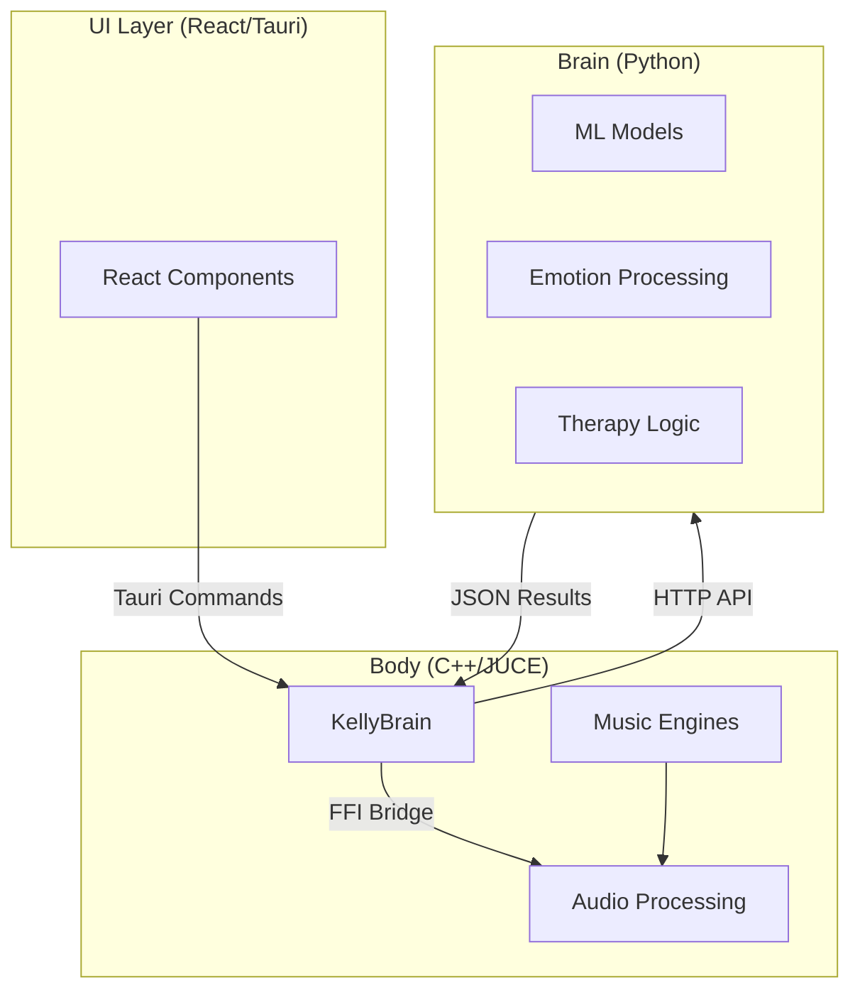

# KmiDi Project Features & Variants: Structured Debate & Discussion

**Version:** 1.0  
**Date:** 2026-01-18  
**Purpose:** Comprehensive analysis of KmiDi's features, implementation variants, and architectural decisions presented as a structured debate. This document serves as both insight into the project and a reference for validating potential outcomes from different approaches.

---

## Table of Contents

1. [Project Overview & Core Mission](#project-overview--core-mission)
2. [Major Architectural Debates](#major-architectural-debates)
   - [2.1 UI Implementation Approaches](#21-ui-implementation-approaches)
   - [2.2 Backend Processing Approaches](#22-backend-processing-approaches)
   - [2.3 Integration Patterns](#23-integration-patterns)
   - [2.4 Deployment Formats](#24-deployment-formats)
3. [Feature Variants & File Organization](#feature-variants--file-organization)
   - [3.1 Emotion Processing Systems](#31-emotion-processing-systems)
   - [3.2 Music Generation Engines](#32-music-generation-engines)
   - [3.3 UI Components](#33-ui-components)
4. [Project Variants (Directory Structure)](#project-variants-directory-structure)
5. [Decision Framework](#decision-framework)
6. [Outcome Validation Matrix](#outcome-validation-matrix)
7. [References & File Maps](#references--file-maps)

---

## Project Overview & Core Mission

### Purpose

KmiDi is an emotion-driven music generation and therapy system that transforms emotional states into musical compositions. The project bridges therapeutic applications with professional music production tools, enabling users to express emotions through music generation.

### Core Value Proposition

- **Therapy Integration:** Music as emotional expression and processing tool
- **Professional Production:** Real-time audio processing with DAW integration
- **AI-Powered Generation:** Machine learning models for emotion-to-music mapping
- **Cross-Platform Access:** Multiple deployment formats (desktop app, plugins, web)

### Key Technologies

1. **React/TypeScript** - Modern responsive user interface
2. **Tauri/Rust** - Desktop integration and inter-process communication
3. **C++/JUCE** - Real-time audio processing and plugin architecture
4. **Python** - Machine learning and AI music generation
5. **Native macOS/Swift** - Platform-specific integrations

### Architectural Philosophy

KmiDi employs a **Brain/Body split architecture**:

- **Brain (Python):** Therapy logic, NLP, harmony generation, intent processing, ML inference
- **Body (C++):** Real-time audio, plugin UI, DAW integration, low-latency processing

This separation addresses fundamental constraints: Python cannot achieve real-time audio performance due to GIL (Global Interpreter Lock) and garbage collection pauses, while C++ provides the deterministic timing required for audio processing but is less suited for rapid ML development.

---

## Major Architectural Debates

### 2.1 UI Implementation Approaches

The choice of UI technology fundamentally affects user experience, development velocity, and platform integration. KmiDi has implemented multiple approaches, each with distinct trade-offs.

#### Variant A: React/Tauri Hybrid

**Location:** `src/components/`, `src-tauri/`  
**Key Files:**
- `src/components/EmotionWheel.tsx` - 3-tier emotion selection interface
- `src/components/SpectoCloudPanel.tsx` - Music visualization component
- `src/components/LyricPanel.tsx` - Lyrics display and editing
- `src/components/GuideViewer.tsx` - Documentation viewer
- `src-tauri/src/commands.rs` - Rust command bridge (lines 1-186)
- `src-tauri/src/bridge/kelly_ffi.rs` - FFI bindings

**Architecture Flow:**
```
React Components → Tauri Commands → FFI Bridge → C++ KellyBrain
```

**Strengths:**

1. **Cross-Platform Deployment**
   - Single codebase for macOS, Windows, Linux
   - React ecosystem enables rapid UI development
   - Tauri provides native desktop integration without Electron's overhead

2. **Modern Development Stack**
   - React 19.1.0 with modern hooks
   - TypeScript 5.8 strict mode for type safety
   - Tailwind CSS 4.x for responsive design
   - Hot reload for rapid iteration

3. **Language Ecosystem Benefits**
   - Access to vast npm package ecosystem
   - React component libraries (emotion wheels, visualizations)
   - Web-based tooling and debugging (React DevTools)

4. **Separation of Concerns**
   - Clear boundary between UI (React) and logic (Rust/C++)
   - FFI bridge isolates native code complexity
   - Easy to test UI components independently

**Weaknesses:**

1. **Performance Overhead**
   - JavaScript execution adds latency to user interactions
   - Virtual DOM reconciliation can cause UI jank
   - Not as performant as native UI for complex animations

2. **Non-Native macOS Feel**
   - UI doesn't perfectly match macOS Human Interface Guidelines
   - Custom components may feel foreign to macOS users
   - Missing native macOS behaviors (drag-and-drop, window management)

3. **Bundle Size**
   - React runtime adds ~100KB+ to bundle
   - Tauri still includes Rust runtime (smaller than Electron but non-zero)
   - Multiple language runtimes in single application

4. **Spec Compliance Challenges**
   - Must manually implement macOS windowing behaviors
   - Focus management and DPI scaling require custom code
   - Compliance with `docs/specs/01_FOUNDATION_SYSTEM_UI.md` requires additional effort

**Decision Context:** Use when cross-platform deployment is required, rapid development is prioritized, or web deployment is a goal.

---

#### Variant B: Native macOS AppKit/SwiftUI

**Location:** `KmiDi_FINAL/apps/macOS/AppKitShell/`  
**Key Files:**
- `AppDelegate.swift` - Application lifecycle management (lines 1-200)
- `MainSplitViewController.swift` - Main window layout
- `MainWindowController.swift` - Window management
- `Inspectors/EmotionInspectorController.swift` - Emotion inspection UI
- `Inspectors/IntentSchemaInspectorController.swift` - Intent schema UI
- `Inspectors/MLDebugPanelView.swift` - ML debugging interface
- `Panels/TimelinePanelController.swift` - Timeline component
- `Panels/InspectorPanelController.swift` - Inspector panel management

**Architecture Flow:**
```
SwiftUI/AppKit Views → Objective-C++ Bridge → JUCE Components → C++ Core
```

**Strengths:**

1. **Native macOS Performance**
   - Direct AppKit integration for zero-overhead UI rendering
   - Metal acceleration for graphics
   - Native macOS animations and transitions
   - Optimized for Apple Silicon

2. **Perfect macOS Compliance**
   - Automatic compliance with Human Interface Guidelines
   - Native windowing, focus management, and DPI handling
   - System integration (menu bar, dock, notifications)
   - Passes App Store review requirements

3. **System Integration**
   - Native drag-and-drop support
   - Accessibility features (VoiceOver, full keyboard access)
   - Dark mode and accent color support
   - System fonts and spacing

4. **Professional User Experience**
   - Feels like a "real" macOS application
   - Users expect native behavior patterns
   - Reduced cognitive load (familiar interface)

**Weaknesses:**

1. **Platform Lock-In**
   - macOS-only implementation
   - Cannot reuse code for Windows/Linux versions
   - Requires separate UI development for each platform

2. **Development Complexity**
   - Swift/Objective-C++ bridge complexity
   - JUCE integration requires careful memory management
   - Two UI paradigms (SwiftUI + AppKit) add learning curve
   - Less developer-friendly than web technologies

3. **Rapid Iteration Challenges**
   - Longer build times
   - Requires Xcode for development
   - Less ecosystem support for UI components
   - Slower feedback loop compared to React hot reload

4. **Maintenance Burden**
   - Separate codebase to maintain
   - Platform-specific bugs and edge cases
   - Additional testing requirements

**Decision Context:** Use when macOS-only deployment is acceptable, native feel is critical, or App Store distribution is required.

---

#### Hybrid Approach: Plugin vs Standalone

**Current Strategy:** Use React/Tauri for plugin and web deployment, SwiftUI/AppKit for standalone macOS app.

**Implementation:**
- **Plugin UI:** React components in `src/components/` rendered via JUCE's web view integration
- **Standalone macOS:** Native SwiftUI/AppKit in `KmiDi_FINAL/apps/macOS/AppKitShell/`
- **Shared Logic:** C++ core (`src/engine/`) used by both

**Debate Points:**

**Pro Hybrid:**
- Best of both worlds: native feel for macOS users, cross-platform for others
- Plugin developers can use familiar web technologies
- Standalone app provides premium native experience

**Con Hybrid:**
- Dual codebase maintenance burden
- Potential inconsistencies between UI variants
- Increased testing complexity

**Recommendation:** The hybrid approach is viable but requires strong architectural boundaries. The C++ core should remain UI-agnostic, with UI variants as thin presentation layers.

---

### 2.2 Backend Processing Approaches

The backend processing architecture determines real-time performance, development velocity, and system capabilities. KmiDi implements a hybrid Brain/Body split to leverage the strengths of both Python and C++.

#### Variant A: Python ML Backend

**Location:** `music_brain/`, `penta_core/`  
**Key Files:**
- `music_brain/api.py` - FastAPI REST server
- `music_brain/tier1/midi_generator.py` - Pre-trained MIDI generation models
- `music_brain/tier1/audio_generator.py` - Audio generation models
- `music_brain/tier2/lora_finetuner.py` - LoRA fine-tuning for customization
- `music_brain/emotion/emotion_thesaurus.py` - Python emotion processing
- `music_brain/orchestrator/orchestrator.py` - High-level orchestration
- `penta_core/__init__.py` - Python bindings for C++ engines (lines 1-326)

**Architecture:** Asynchronous Python server with ML model inference

**Strengths:**

1. **ML Ecosystem Access**
   - PyTorch, TensorFlow, transformers libraries
   - Pre-trained models (GPT, MusicLM, MusicGen)
   - Rapid experimentation with new architectures
   - Extensive ML research community support

2. **Rapid Development**
   - Python's expressiveness for complex logic
   - Fast iteration cycles
   - Easy integration with external APIs
   - Rich data processing libraries (pandas, numpy)

3. **Therapy Logic Flexibility**
   - NLP libraries (spaCy, transformers) for text processing
   - Easy to implement domain-specific therapy patterns
   - Dynamic runtime behavior (can load new models without recompilation)
   - Extensible plugin architecture for custom processors

4. **Non-Real-Time Processing**
   - Perfect for offline music generation
   - Batch processing capabilities
   - Complex computations without time constraints
   - Web API integration (FastAPI)

**Weaknesses:**

1. **Not Real-Time Capable**
   - Garbage Collector pauses (5-20ms) break audio deadlines
   - Global Interpreter Lock prevents true parallelism
   - Python execution overhead (50-100x slower than C++ for raw math)
   - Cannot meet sub-10ms audio processing requirements

2. **Memory Overhead**
   - Python objects have significant memory overhead
   - ML models require large memory allocations
   - Garbage collection adds unpredictability

3. **Integration Complexity**
   - Requires network/IPC layer for real-time systems
   - Serialization overhead (JSON) for data exchange
   - Potential latency for state synchronization

**Decision Context:** Use for ML inference, NLP processing, offline generation, and therapy logic that doesn't require real-time constraints.

**Critical Constraint:** As documented in `docs/cpp_audio_architecture.md`, Python **cannot** be used in the audio thread. All real-time audio processing must occur in C++.

---

#### Variant B: C++ Native Processing

**Location:** `src/engine/`, `cpp_music_brain/`  
**Key Files:**
- `src/engine/KellyBrain.cpp` - Main orchestration (high-level API)
- `src/engine/KellyBrain.h` - Interface definition (lines 1-137)
- `src/engine/EmotionThesaurus.cpp` - 216-node emotion mapping
- `src/engine/EmotionThesaurus.h` - Emotion system interface (lines 1-113)
- `src/engine/IntentPipeline.cpp` - Intent processing pipeline
- `src/engines/*` - 15 specialized music generation engines (see Section 3.2)

**Architecture:** Real-time C++ processing with deterministic timing

**Strengths:**

1. **Real-Time Performance**
   - Deterministic execution (no GC pauses)
   - Sub-millisecond latency for audio processing
   - Direct memory access (no indirection overhead)
   - SIMD optimizations (AVX2/FMA) for vectorized operations

2. **Audio Thread Safety**
   - Lock-free data structures for audio thread communication
   - Pre-allocated buffers to avoid allocations in audio callback
   - RAII memory management
   - Thread-safe reference counting

3. **Professional Audio Processing**
   - JUCE framework provides industry-standard audio APIs
   - Plugin format support (VST3, AU, CLAP)
   - Low-level audio I/O access
   - Professional-grade DSP primitives

4. **System Integration**
   - Direct access to operating system APIs
   - Native threading and synchronization primitives
   - Hardware-accelerated operations
   - Minimal runtime dependencies

**Weaknesses:**

1. **Development Velocity**
   - Longer compilation times
   - More verbose code (compared to Python)
   - Manual memory management (risk of leaks/crashes)
   - Steeper learning curve

2. **ML Integration Challenges**
   - Limited ML framework support (compared to Python)
   - Model inference requires external libraries or conversions
   - Less ecosystem support for research models
   - Harder to prototype new ML approaches

3. **Maintenance Complexity**
   - Platform-specific code paths (macOS/Windows/Linux)
   - Complex build systems (CMake)
   - Debugging native code is more challenging
   - Less developer-friendly tooling

**Decision Context:** Use for all real-time audio processing, plugin implementations, and any code that runs in the audio thread.

---

#### Variant C: Hybrid Brain/Body Split (Current Architecture)

**Architecture:** Python "Brain" handles ML and logic; C++ "Body" handles real-time audio

**Communication Patterns:**

1. **FFI Bridge (Primary):** Direct C function calls between Rust and C++
   - Files: `src/bridge/kelly_ffi.cpp`, `src-tauri/src/bridge/kelly_ffi.rs`
   - Latency: < 1ms overhead
   - Use case: Real-time state queries and control

2. **HTTP API (Fallback):** REST API for Python backend
   - Files: `music_brain/api.py`
   - Latency: Network-dependent (typically 10-50ms)
   - Use case: Offline generation, complex ML inference

3. **OSC Protocol (DAW Integration):** Open Sound Control for external systems
   - Documented in `docs/cpp_audio_architecture.md`
   - Latency: Real-time capable (UDP)
   - Use case: DAW integration, external control surfaces

**Data Flow:**



**When to Use Python vs C++:**

| Task | Use | Rationale |
|------|-----|-----------|
| Real-time audio processing | C++ | Sub-10ms latency requirement |
| ML model inference | Python | Ecosystem and flexibility |
| Emotion text parsing | Python | NLP libraries |
| MIDI generation (real-time) | C++ | Audio thread requirement |
| MIDI generation (offline) | Python | Can use ML models |
| Harmony analysis | Either | C++ for real-time, Python for complex analysis |
| Plugin UI | C++/JUCE | Host integration requirements |
| Standalone app UI | React/Tauri or Swift | Cross-platform vs native |

**Debate Points:**

**Pro Hybrid:**
- Leverages strengths of both languages
- Clear separation of concerns (real-time vs non-real-time)
- Flexible architecture (can optimize each layer independently)
- Follows industry best practices (Brain/Body pattern)

**Con Hybrid:**
- Increased system complexity
- Multiple language runtimes
- Cross-language debugging challenges
- Potential serialization overhead

**Recommendation:** The hybrid approach is well-justified given the constraints. The key is maintaining clear boundaries and using appropriate communication patterns for each use case.

---

### 2.3 Integration Patterns

Different integration patterns serve different use cases, from real-time control to batch processing.

#### Variant A: FFI Bridge (Direct)

**Location:** `src/bridge/kelly_ffi.cpp`, `src-tauri/src/bridge/kelly_ffi.rs`  
**Type:** C Foreign Function Interface

**Key Functions:**
- `kelly_brain_create()` - Create KellyBrain instance
- `kelly_brain_initialize()` - Initialize with data path
- `kelly_brain_from_text()` - Generate intent from text
- `kelly_brain_generate_midi()` - Generate MIDI from intent

**Strengths:**

1. **Low Latency**
   - Direct function calls (no serialization)
   - < 1ms overhead for simple operations
   - Suitable for real-time state queries
   - Zero-copy where possible

2. **Memory Efficiency**
   - Direct memory access
   - No JSON serialization overhead
   - Shared memory can be used for large buffers
   - Efficient for frequent calls

3. **Real-Time Capable**
   - Can be called from audio thread (with care)
   - Deterministic execution
   - No network stack overhead

4. **Type Safety (with Rust)**
   - Rust provides safe wrappers around C FFI
   - Compile-time checking of function signatures
   - Memory safety guarantees (Rust side)

**Weaknesses:**

1. **Complexity**
   - Manual memory management (C side)
   - Requires careful lifetime management
   - Cross-language debugging is challenging
   - Platform-specific calling conventions

2. **Limited Flexibility**
   - Function signatures must be defined at compile time
   - Cannot easily add new functions without recompilation
   - Less dynamic than HTTP API

3. **Error Handling**
   - C error codes are less expressive than exceptions
   - Error propagation across languages is complex
   - Requires careful error code design

**Decision Context:** Use for real-time operations, frequent state queries, and when latency is critical.

**Implementation Example:**
```rust
// src-tauri/src/bridge/kelly_ffi.rs
#[link(name = "KellyFFI")]
extern "C" {
    fn kelly_brain_create() -> *mut KellyBrainHandle;
    fn kelly_brain_from_text(brain: *mut KellyBrainHandle, text: *const c_char) -> *mut c_char;
}
```

---

#### Variant B: HTTP API

**Location:** `music_brain/api.py`  
**Type:** FastAPI REST server

**Key Endpoints:**
- `POST /generate/midi` - Generate MIDI from emotion
- `POST /analyze/emotion` - Analyze text for emotion
- `GET /emotions` - List available emotions
- `POST /generate/audio` - Generate audio from MIDI

**Strengths:**

1. **Language Agnostic**
   - Any language can make HTTP requests
   - Easy integration with web applications
   - Standard protocol (HTTP/JSON)

2. **Easy Testing**
   - Standard HTTP testing tools (curl, Postman)
   - Can test without UI
   - Easy to mock for unit tests

3. **Web Integration**
   - Direct browser integration
   - Cloud deployment possibilities
   - Horizontal scaling (multiple servers)

4. **Flexibility**
   - Easy to add new endpoints
   - Versioning support via URL paths
   - Can evolve API without breaking changes

**Weaknesses:**

1. **Network Latency**
   - HTTP overhead (TCP handshake, headers)
   - JSON serialization/deserialization
   - Typically 10-50ms even on localhost
   - Not suitable for real-time audio

2. **Reliability**
   - Network failures can interrupt operations
   - Requires error handling for network issues
   - Potential for timeouts

3. **Resource Overhead**
   - HTTP server requires separate process
   - Additional memory for server runtime
   - Network stack overhead

**Decision Context:** Use for offline processing, web integration, cloud deployment, and when real-time constraints don't apply.

---

#### Variant C: OSC Protocol

**Location:** Documented in `docs/cpp_audio_architecture.md`  
**Type:** Open Sound Control (UDP-based)

**Key Features:**
- Real-time message passing
- Industry standard for audio/MIDI control
- UDP-based (low latency, best-effort delivery)

**Strengths:**

1. **Real-Time Capable**
   - UDP provides low latency
   - Designed for audio/MIDI control
   - Used by professional audio software

2. **DAW Integration**
   - Standard protocol for DAW communication
   - Works with Logic Pro, Ableton, etc.
   - External control surface support

3. **Flexible Message Format**
   - Typed arguments (int, float, string, blob)
   - Address patterns for routing
   - Bundle support for atomic operations

**Weaknesses:**

1. **UDP Reliability**
   - Best-effort delivery (packets can be lost)
   - No guaranteed ordering
   - Requires application-level reliability if needed

2. **Setup Complexity**
   - Requires network configuration
   - Firewall considerations
   - Port management

**Decision Context:** Use for DAW integration, external hardware control, and real-time parameter automation.

---

### 2.4 Deployment Formats

KmiDi supports multiple deployment formats to serve different user needs and distribution channels.

#### Variant A: Standalone Desktop App

**Location:** `KmiDi_FINAL/apps/macOS/AppKitShell/`  
**Format:** Native macOS application bundle

**Implementation:**
- SwiftUI/AppKit for native macOS UI
- Embedded C++ core as dynamic library
- Self-contained bundle with all dependencies

**Use Cases:**
- Primary application for end users
- App Store distribution
- Standalone music therapy sessions
- Full-featured music production

**Strengths:**
- Native user experience
- System integration (menu bar, dock, notifications)
- Professional appearance
- Can be code-signed and notarized

**Weaknesses:**
- Platform-specific (macOS only in current implementation)
- Larger download size
- Requires separate builds for each platform

---

#### Variant B: Audio Plugin Suite

**Location:** `KmiDi_FINAL/plugins/iDAW_Core/`, `src/plugin/`  
**Formats:** VST3, Audio Unit (AU), CLAP

**Implementation:**
- JUCE-based plugin architecture
- Plugin UI can be React (via web view) or native JUCE components
- Host integration via JUCE AudioProcessorEditor

**Key Plugins:**
- **Brush** - Painting-style interface for music generation
- **Chalk** - Sketch-based interaction
- **Eraser** - Removal/editing tool
- **Palette** - Color/emotion selection
- **Parrot** - Echo/repetition effects
- **Pencil** - Precise editing
- **Press** - Pressure-sensitive generation
- **Smudge** - Blending effects
- **Stamp** - Pattern application
- **Stencil** - Constraint-based generation
- **Trace** - Following/pattern matching

**Use Cases:**
- Integration into existing DAW workflows
- Professional music production
- Real-time performance
- Studio recording sessions

**Strengths:**
- Integrates with user's existing workflow
- Can be used alongside other plugins
- Host handles audio I/O and project management
- Standard plugin format compatibility

**Weaknesses:**
- Requires compatible DAW
- Plugin UI constraints (host limitations)
- Cannot access full system features
- Host-dependent behavior

**Host Compatibility:**
- Logic Pro X (AU)
- Pro Tools (AAX - if implemented)
- Reaper (VST3)
- Ableton Live (VST3)
- FL Studio (VST3)

---

#### Variant C: Web Application

**Location:** `web/`, React components in `src/components/`  
**Format:** Progressive Web App (PWA) or hosted web app

**Implementation:**
- React frontend
- Python API backend (`music_brain/api.py`)
- Can be deployed to cloud services

**Use Cases:**
- Browser-based access
- Cross-platform without installation
- Sharing and collaboration features
- Cloud-based processing

**Strengths:**
- No installation required
- Accessible from any device with browser
- Easy updates (server-side)
- Can leverage cloud ML processing

**Weaknesses:**
- Cannot do real-time audio (browser limitations)
- Requires internet connection for full functionality
- Limited system integration
- Performance constraints

**Current Status:** Web deployment is partially implemented. Full implementation would require cloud infrastructure for Python backend.

---

## Feature Variants & File Organization

### 3.1 Emotion Processing Systems

KmiDi implements multiple approaches to emotion processing, each serving different use cases.

#### EmotionThesaurus (C++)

**Location:** `src/engine/EmotionThesaurus.cpp`, `src/engine/EmotionThesaurus.h`  
**Architecture:** 216-node hierarchical emotion thesaurus

**Structure:**
- 6 base emotions × 6 sub-emotions × 6 sub-sub-emotions = 216 nodes
- VAD (Valence-Arousal-Dominance) dimensional mapping
- Intensity scaling (0.0 to 1.0)

**Key Methods:**
- `findById(int id)` - Direct ID lookup
- `findByName(string name)` - Case-insensitive name lookup
- `findNearest(float v, float a, float i)` - Nearest neighbor by VAI
- `findNearestVAD(float v, float a, float d)` - Nearest neighbor by VAD

**Use Case:** Real-time emotion mapping for audio generation

**Strengths:**
- Fast lookup (O(1) for ID, O(n) for name)
- Thread-safe (mutex-protected)
- Deterministic mapping (no ML inference overhead)
- Suitable for audio thread queries

**Weaknesses:**
- Fixed emotion set (cannot dynamically add emotions)
- Limited nuance compared to ML-based approaches
- Requires pre-defined emotion database

---

#### QuantumEmotionalField (C++)

**Location:** `src/engine/QuantumEmotionalField.cpp`, `src/engine/QuantumEmotionalField.h`  
**Architecture:** Quantum-inspired continuous emotion space

**Concept:** Treats emotions as quantum states in a continuous field, allowing superposition and entanglement effects.

**Use Case:** Advanced emotion modeling for complex emotional states

**Strengths:**
- Continuous emotion space (not discrete nodes)
- Can represent mixed/ambiguous emotions
- Novel approach for creative applications

**Weaknesses:**
- Complex implementation
- Less interpretable than discrete thesaurus
- May not align with psychological models

**Debate Point:** Is quantum-inspired modeling useful, or is it unnecessary complexity? Current implementation status unclear.

---

#### VADSystem (C++)

**Location:** `src/engine/VADSystem.cpp`, `src/engine/VADSystem.h`, `src/engine/VADCalculator.cpp`  
**Architecture:** Valence-Arousal-Dominance dimensional model

**Structure:**
- **Valence:** -1.0 (negative) to +1.0 (positive) - pleasantness
- **Arousal:** 0.0 (calm) to 1.0 (excited) - energy level
- **Dominance:** 0.0 (submissive) to 1.0 (dominant) - sense of control

**Use Case:** Continuous emotion representation for real-time parameter control

**Strengths:**
- Well-established psychological model
- Continuous dimensions allow smooth transitions
- Direct mapping to musical parameters (tempo, key, dynamics)

**Weaknesses:**
- Requires conversion from discrete emotions
- Three dimensions may oversimplify complex emotions

---

#### Python Emotion Processing

**Location:** `music_brain/emotion/emotion_thesaurus.py`, `music_brain/emotion/text_emotion_parser.py`  
**Architecture:** NLP-based emotion extraction from text

**Key Components:**
- Text parsing for emotion extraction
- Multimodal emotion processing (text + audio + visual)
- ML-based emotion classification

**Use Case:** Offline emotion analysis, text-to-emotion conversion

**Strengths:**
- Can extract emotions from natural language
- ML models can learn complex emotion patterns
- Multimodal processing capabilities

**Weaknesses:**
- Not real-time capable
- Requires ML model inference
- Less deterministic than rule-based systems

---

#### Comparison Matrix

| System | Real-Time | Precision | Complexity | Use Case |
|--------|-----------|-----------|------------|----------|
| EmotionThesaurus | Yes | High (discrete) | Low | Audio generation |
| QuantumEmotionalField | Yes | Medium | High | Advanced modeling |
| VADSystem | Yes | Medium (continuous) | Low | Parameter control |
| Python NLP | No | High (ML) | Medium | Text analysis |

**Recommendation:** Use EmotionThesaurus for real-time audio generation, VADSystem for continuous control, and Python NLP for text input processing.

---

### 3.2 Music Generation Engines

KmiDi implements 15 specialized music generation engines in C++ for real-time processing, plus Python-based generation for offline use.

#### C++ Engines (Real-Time)

**Location:** `src/engines/`  
**Count:** 15 engines

**Engine List:**

1. **ArrangementEngine** (`ArrangementEngine.h/cpp`)
   - Handles song structure and section arrangement
   - Verse-chorus-bridge patterns
   - Section transitions

2. **BassEngine** (`BassEngine.h/cpp`)
   - Bass line generation
   - Root note emphasis
   - Rhythmic patterns

3. **CounterMelodyEngine** (`CounterMelodyEngine.h/cpp`)
   - Secondary melody generation
   - Harmonic counterpoint
   - Voice leading

4. **DrumGrooveEngine** (`DrumGrooveEngine.h/cpp`)
   - Drum pattern generation
   - Groove quantization
   - Style-based patterns

5. **DynamicsEngine** (`DynamicsEngine.h/cpp`)
   - Volume and expression control
   - Crescendo/decrescendo
   - Emotional dynamics mapping

6. **FillEngine** (`FillEngine.h/cpp`)
   - Fill patterns (drum fills, melodic fills)
   - Transition material
   - Pattern variation

7. **GrooveEngine** (`GrooveEngine.h/cpp`)
   - Rhythmic groove patterns
   - Swing and shuffle
   - Timing feel

8. **MelodyEngine** (`MelodyEngine.h/cpp`)
   - Primary melody generation
   - Scale-aware generation
   - Contour shaping

9. **PadEngine** (`PadEngine.h/cpp`)
   - Pad/sustained texture generation
   - Harmonic pads
   - Atmospheric textures

10. **RhythmEngine** (`RhythmEngine.h/cpp`)
    - Rhythmic pattern generation
    - Time signature handling
    - Polyrhythms

11. **StringEngine** (`StringEngine.h/cpp`)
    - String section generation
    - Orchestral strings
    - Ensemble arrangements

12. **TensionEngine** (`TensionEngine.h/cpp`)
    - Harmonic tension generation
    - Dissonance/consonance control
    - Emotional tension mapping

13. **TransitionEngine** (`TransitionEngine.h/cpp`)
    - Section transitions
    - Modulations
    - Bridge material

14. **VariationEngine** (`VariationEngine.h/cpp`)
    - Pattern variation
    - Motivic development
    - Thematic variation

15. **VoiceLeadingEngine** (`VoiceLeading.h/cpp`)
    - Voice leading optimization
    - Smooth chord transitions
    - Harmonic voice movement

**Architecture:** Each engine implements a common interface and can be composed together by KellyBrain.

**Strengths:**
- Real-time capable (C++ implementation)
- Modular design (can enable/disable engines)
- Specialized for specific musical tasks
- Deterministic output

**Weaknesses:**
- Rule-based (not ML-generated)
- Requires careful parameter tuning
- May not capture complex musical patterns
- Limited learning/adaptation

---

#### Python Generation (Offline)

**Location:** `music_brain/tier1/`, `music_brain/generative/`  
**Key Files:**
- `music_brain/tier1/midi_generator.py` - Pre-trained MIDI generation
- `music_brain/tier1/audio_generator.py` - Audio generation models
- `music_brain/generative/chord_generator.py` - ML-based chord generation
- `music_brain/generative/melody_vae.py` - Variational autoencoder for melodies

**Architecture:** ML model inference for music generation

**Models:**
- Pre-trained transformers for MIDI generation
- VAE models for melody/harmony
- Diffusion models for audio generation (potential)

**Strengths:**
- Can learn complex musical patterns from data
- Adaptable to different styles
- Can generate novel musical ideas
- Leverages large-scale ML models

**Weaknesses:**
- Not real-time capable
- Requires GPU for fast inference
- Model size limitations
- Less control over output

---

#### Comparison: Rule-Based vs ML-Based

**Rule-Based (C++ Engines):**
- **Deterministic:** Same input → same output
- **Fast:** Real-time capable
- **Controllable:** Precise parameter control
- **Limited:** Cannot learn new patterns

**ML-Based (Python):**
- **Stochastic:** Same input → varied output
- **Slow:** Requires inference time
- **Flexible:** Can adapt to new styles
- **Unpredictable:** Hard to control precisely

**Hybrid Approach (Recommended):**
- Use ML for initial generation or inspiration
- Use rule-based engines for real-time refinement
- ML provides "seed" material, engines provide structure

---

### 3.3 UI Components

UI components vary by deployment format: React for web/plugin, SwiftUI/AppKit for native macOS.

#### React Components

**Location:** `src/components/`  
**Key Components:**

1. **EmotionWheel.tsx** + **EmotionWheel.css**
   - 3-tier emotion selection interface
   - Visual emotion wheel
   - VAD parameter visualization

2. **SpectoCloudPanel.tsx**
   - Music visualization component
   - Spectral display
   - Real-time audio visualization

3. **LyricPanel.tsx**
   - Lyrics display and editing
   - Text input for emotional expression
   - Integration with music generation

4. **GuideViewer.tsx**
   - Documentation viewer
   - Markdown rendering
   - Navigation for guides

5. **GuideNav.tsx**
   - Navigation component for guides
   - Sidebar navigation
   - Search functionality

**Architecture:** React functional components with TypeScript

**Integration:** Components use Tauri commands to communicate with Rust/C++ backend

**Strengths:**
- Reusable across web and desktop
- Rich ecosystem of React libraries
- Easy to style with CSS/Tailwind
- Hot reload for development

**Weaknesses:**
- JavaScript execution overhead
- Virtual DOM reconciliation
- Not native macOS components

---

#### SwiftUI/AppKit Components

**Location:** `KmiDi_FINAL/apps/macOS/AppKitShell/Sources/KmiDiApp/`  
**Key Components:**

1. **Inspectors/**
   - `EmotionInspectorController.swift` + `EmotionInspectorView.swift`
   - `IntentSchemaInspectorController.swift` + `IntentSchemaInspectorView.swift`
   - `MLDebugPanelView.swift`

2. **Panels/**
   - `TimelinePanelController.swift` - Timeline component
   - `InspectorPanelController.swift` - Inspector panel management
   - `BrowserPanelController.swift` - File browser

3. **Main UI:**
   - `MainSplitViewController.swift` - Main window layout
   - `MainWindowController.swift` - Window management

**Architecture:** SwiftUI views with AppKit controllers for complex UI

**Integration:** Objective-C++ bridge to JUCE components, direct C++ access

**Strengths:**
- Native macOS appearance and behavior
- System integration (dark mode, accent colors)
- Professional UI components
- Optimized rendering

**Weaknesses:**
- macOS-only
- Less reusable code
- Steeper learning curve

---

## Project Variants (Directory Structure)

KmiDi exists in multiple directory structures, each representing different development stages, purposes, or implementation approaches.

### KmiDi (Primary Active)

**Location:** `/Users/seanburdges/KmiDi/`  
**Focus:** React/Tauri hybrid, unified architecture  
**Status:** Primary active development repository

**Key Characteristics:**
- Modern web stack (React 19, TypeScript 5.8, Tailwind 4)
- Tauri desktop integration
- Comprehensive documentation (`docs/`)
- Unified monorepo structure

**File Organization:**
```
KmiDi/
├── src/                    # C++ implementation
│   ├── engine/            # Kelly Brain (50+ components)
│   ├── engines/           # Music engines (15 engines)
│   ├── components/        # React UI components
│   └── bridge/            # FFI interface
├── src-tauri/             # Rust desktop integration
├── music_brain/           # Python ML backend
├── docs/                  # Comprehensive documentation
└── config/                # Build configurations
```

**Use Case:** Primary development, cross-platform deployment

---

### KmiDi_FINAL (Native macOS)

**Location:** `KmiDi-1/KmiDi_FINAL/`  
**Focus:** Native macOS app with AppKit/SwiftUI  
**Status:** Specialized macOS implementation

**Key Characteristics:**
- Native SwiftUI/AppKit implementation
- JUCE plugin suite (11 plugins)
- macOS-specific optimizations
- App Store ready structure

**File Organization:**
```
KmiDi_FINAL/
├── apps/macOS/AppKitShell/    # Native macOS app
├── plugins/iDAW_Core/         # Plugin suite
├── engine/                    # C++ core (524 files)
├── python/                    # Python backend
└── ml/                        # ML models
```

**Use Case:** macOS App Store distribution, native macOS experience

---

### KmiDi_BACKUP (Reference)

**Location:** `KmiDi-1/KmiDi_BACKUP/`  
**Focus:** Historical reference, backup codebase  
**Status:** Archive/reference

**Key Characteristics:**
- Backup of previous implementations
- Reference for recovery
- Historical development patterns

**Use Case:** Recovery reference, comparison with current implementation

---

### KmiDi_PROJECT (Development)

**Location:** `KmiDi-1/KmiDi_PROJECT/`  
**Focus:** Active development variant  
**Status:** Experimental/development

**Key Characteristics:**
- Experimental features
- Alternative implementations
- Testing ground for new approaches

**Use Case:** Feature experimentation, alternative implementations

---

### KmiDi_TRAINING (ML Focus)

**Location:** `KmiDi-1/KmiDi_TRAINING/`  
**Focus:** Machine learning training scripts  
**Status:** ML development

**Key Characteristics:**
- Training scripts for ML models
- Model evaluation code
- Dataset processing

**Use Case:** ML model development, training pipelines

---

## Decision Framework

When making architectural decisions, consider the following factors:

### Performance Implications

**Real-Time Requirements:**
- **Audio processing:** Must use C++ (sub-10ms latency)
- **UI updates:** Can use React (60fps sufficient)
- **State queries:** FFI bridge for real-time, HTTP for batch

**Benchmarks:**
- C++ audio processing: < 1ms per buffer (512 samples @ 48kHz)
- React UI updates: 16ms budget (60fps)
- FFI call overhead: < 1ms
- HTTP API latency: 10-50ms (localhost)

---

### Development Complexity

**Learning Curve:**
- **React/TypeScript:** Moderate (web developers familiar)
- **Swift/SwiftUI:** Moderate (iOS/macOS developers familiar)
- **C++/JUCE:** Steep (audio programming expertise required)
- **Python ML:** Moderate (data scientists familiar)

**Tooling:**
- React: Excellent (VS Code, React DevTools, hot reload)
- Swift: Good (Xcode, SwiftUI previews)
- C++: Moderate (CMake, gdb/lldb, no hot reload)
- Python: Excellent (Jupyter, PyCharm, interactive debugging)

---

### Maintainability Factors

**Code Reusability:**
- React components: High (web + desktop)
- Swift views: Low (macOS-only)
- C++ core: High (all platforms)
- Python logic: High (cross-platform)

**Testing:**
- React: Excellent (Vitest, React Testing Library)
- Swift: Good (XCTest)
- C++: Moderate (Catch2, manual setup)
- Python: Excellent (pytest)

**Documentation:**
- React: Good (TypeScript provides types as docs)
- Swift: Moderate (Swift doc comments)
- C++: Requires careful documentation
- Python: Excellent (docstrings, type hints)

---

### Platform Compatibility

| Component | macOS | Windows | Linux | Web |
|-----------|-------|---------|-------|-----|
| React/Tauri | Yes | Yes | Yes | Yes (web) |
| SwiftUI | Yes | No | No | No |
| C++/JUCE | Yes | Yes | Yes | No |
| Python | Yes | Yes | Yes | Yes (server) |

---

### Use Case Alignment

**Therapy Application:**
- **UI:** React/Tauri (accessibility, cross-platform)
- **Backend:** Python (therapy logic, NLP)
- **Audio:** C++ (real-time playback)

**Professional Production:**
- **UI:** SwiftUI (macOS) or React (plugin)
- **Backend:** C++ (real-time generation)
- **Audio:** C++ (DAW integration)

**Web Application:**
- **UI:** React (browser)
- **Backend:** Python (cloud API)
- **Audio:** Not real-time (limitation)

---

### Future Extensibility

**Adding New Features:**
- **React UI:** Easy (component ecosystem)
- **Swift UI:** Moderate (AppKit/SwiftUI learning)
- **C++ Engine:** Moderate (requires audio expertise)
- **Python Backend:** Easy (ML ecosystem)

**Platform Expansion:**
- **React/Tauri:** Easy (cross-platform built-in)
- **Swift:** Impossible (Apple platforms only)
- **C++:** Moderate (JUCE handles cross-platform)
- **Python:** Easy (cross-platform runtime)

---

## Outcome Validation Matrix

This matrix shows how different architectural choices lead to different outcomes for specific scenarios.

### Scenario 1: Need Sub-10ms Audio Latency

**Requirement:** Real-time audio processing with < 10ms latency

**Choices:**
- ✅ **C++ Implementation** → Meets requirement
  - Direct memory access, no GC pauses
  - Deterministic execution
  - SIMD optimizations possible
  
- ❌ **Python Implementation** → Cannot meet requirement
  - GC pauses (5-20ms) break deadlines
  - GIL prevents true parallelism
  - Execution overhead too high

**Validation:** C++ required for audio thread processing. Python can only be used for offline generation.

**Files:**
- `src/engine/KellyBrain.cpp` - C++ implementation
- `docs/cpp_audio_architecture.md` - Rationale documentation

---

### Scenario 2: Cross-Platform Deployment

**Requirement:** Deploy to macOS, Windows, and Linux

**Choices:**
- ✅ **React/Tauri** → Meets requirement
  - Single codebase for all platforms
  - Tauri handles platform differences
  - Consistent UI across platforms
  
- ❌ **SwiftUI/AppKit** → Cannot meet requirement
  - macOS-only implementation
  - Would require separate Windows/Linux implementations

**Validation:** React/Tauri enables cross-platform deployment with single codebase.

**Files:**
- `src/components/*.tsx` - React components
- `src-tauri/` - Tauri desktop integration

---

### Scenario 3: Native macOS Feel

**Requirement:** Application must feel like a native macOS app

**Choices:**
- ✅ **SwiftUI/AppKit** → Meets requirement
  - Native system integration
  - Follows HIG automatically
  - Professional appearance
  
- ⚠️ **React/Tauri** → Partial compliance
  - Can approximate native feel
  - Requires manual HIG compliance
  - May feel "webby" to macOS users

**Validation:** SwiftUI/AppKit provides best native macOS experience, but React/Tauri can be acceptable with careful design.

**Files:**
- `KmiDi_FINAL/apps/macOS/AppKitShell/` - Native implementation
- `docs/specs/01_FOUNDATION_SYSTEM_UI.md` - Spec compliance requirements

---

### Scenario 4: Rapid ML Iteration

**Requirement:** Quickly experiment with new ML models and approaches

**Choices:**
- ✅ **Python Backend** → Meets requirement
  - Access to ML ecosystem (PyTorch, transformers)
  - Rapid prototyping with Jupyter notebooks
  - Easy model integration
  
- ❌ **C++ Implementation** → Slower iteration
  - Limited ML framework support
  - Longer compilation times
  - Harder to prototype

**Validation:** Python backend enables rapid ML development, but results must be integrated into C++ for real-time use.

**Files:**
- `music_brain/tier1/` - Python ML models
- `music_brain/api.py` - API for model access

---

### Scenario 5: Plugin Integration

**Requirement:** Integrate as plugin into existing DAW

**Choices:**
- ✅ **JUCE/C++ Plugin** → Meets requirement
  - Industry-standard plugin framework
  - VST3/AU/CLAP support
  - Real-time audio processing
  
- ❌ **React Standalone** → Cannot meet requirement
  - No plugin format support
  - Cannot integrate into DAW workflow

**Validation:** JUCE/C++ required for plugin deployment. React can be used for plugin UI via web view.

**Files:**
- `KmiDi_FINAL/plugins/iDAW_Core/` - Plugin implementations
- `src/plugin/` - Plugin architecture

---

### Scenario 6: Web Deployment

**Requirement:** Access application from web browser

**Choices:**
- ✅ **React Web App + Python API** → Meets requirement
  - React runs in browser
  - Python API on server
  - Cloud deployment possible
  
- ❌ **C++ Standalone** → Cannot meet requirement
  - Cannot run C++ in browser
  - Requires native application

**Validation:** Web deployment requires web technologies (React) and server-side backend (Python API).

**Files:**
- `web/` - Web application
- `music_brain/api.py` - Server API

---

## References & File Maps

### Architecture Documentation

**Primary References:**
- `docs/ARCHITECTURE.md` - Multi-technology architecture overview
- `docs/cpp_audio_architecture.md` - Brain/Body split rationale
- `docs/API.md` - Complete API reference
- `CROSS_EXAMINATION_SUMMARY.md` - Compliance and implementation status
- `KMIDI_STRUCTURE_PLAN.md` - Repository structure plan

**Specifications:**
- `KmiDi-1/docs/specs/01_FOUNDATION_SYSTEM_UI.md` - System UI specifications
- `KmiDi-1/docs/specs/02_LAYOUT_NAVIGATION.md` - Layout specifications
- `KmiDi-1/docs/specs/03_VISUAL_SYSTEM.md` - Visual system specifications
- `KmiDi-1/docs/specs/04_CORE_MUSICAL_UI.md` - Musical UI specifications
- `KmiDi-1/docs/specs/05_AI_ML_VISIBILITY.md` - AI/ML visibility specs
- `KmiDi-1/docs/specs/06_CONTROL_TRUST.md` - Control and trust specifications
- `KmiDi-1/docs/specs/07_PLUGIN_SPECIFIC.md` - Plugin-specific requirements
- `KmiDi-1/docs/specs/08_OUTPUT_VERIFICATION.md` - Output verification specs
- `KmiDi-1/docs/specs/09_DOCUMENTATION_REPO.md` - Documentation requirements

---

### Implementation Files by Variant

#### React/Tauri Implementation

**UI Components:**
- `src/components/EmotionWheel.tsx` - Emotion selection interface
- `src/components/SpectoCloudPanel.tsx` - Music visualization
- `src/components/LyricPanel.tsx` - Lyrics interface
- `src/components/GuideViewer.tsx` - Documentation viewer
- `src/components/GuideNav.tsx` - Navigation component

**Tauri Integration:**
- `src-tauri/src/commands.rs` - Tauri command definitions (186 lines)
- `src-tauri/src/bridge/kelly_ffi.rs` - FFI bindings
- `src-tauri/src/state.rs` - State management
- `src-tauri/src/events.rs` - Event system

**Hooks:**
- `src/hooks/useKellyBrain.ts` - KellyBrain integration hook
- `src/hooks/useMusicBrain.ts` - MusicBrain API hook

---

#### Native macOS Implementation

**Application:**
- `KmiDi_FINAL/apps/macOS/AppKitShell/Sources/KmiDiApp/AppDelegate.swift` - App lifecycle
- `KmiDi_FINAL/apps/macOS/AppKitShell/Sources/KmiDiApp/MainWindowController.swift` - Window management
- `KmiDi_FINAL/apps/macOS/AppKitShell/Sources/KmiDiApp/MainSplitViewController.swift` - Main layout

**Inspectors:**
- `KmiDi_FINAL/apps/macOS/AppKitShell/Sources/KmiDiApp/Inspectors/EmotionInspectorController.swift`
- `KmiDi_FINAL/apps/macOS/AppKitShell/Sources/KmiDiApp/Inspectors/EmotionInspectorView.swift`
- `KmiDi_FINAL/apps/macOS/AppKitShell/Sources/KmiDiApp/Inspectors/IntentSchemaInspectorController.swift`
- `KmiDi_FINAL/apps/macOS/AppKitShell/Sources/KmiDiApp/Inspectors/MLDebugPanelView.swift`

**Panels:**
- `KmiDi_FINAL/apps/macOS/AppKitShell/Sources/KmiDiApp/Panels/TimelinePanelController.swift`
- `KmiDi_FINAL/apps/macOS/AppKitShell/Sources/KmiDiApp/Panels/InspectorPanelController.swift`
- `KmiDi_FINAL/apps/macOS/AppKitShell/Sources/KmiDiApp/Panels/BrowserPanelController.swift`

**JUCE Integration:**
- `KmiDi_FINAL/apps/macOS/AppKitShell/Sources/KmiDiApp/JUCE/JUCEHostView.h` - JUCE component hosting
- `KmiDi_FINAL/apps/macOS/AppKitShell/Sources/KmiDiApp/JUCE/JUCEHostView.mm` - Objective-C++ bridge
- `KmiDi_FINAL/apps/macOS/AppKitShell/Sources/KmiDiApp/JUCE/TimelineComponent.cpp` - Timeline component
- `KmiDi_FINAL/apps/macOS/AppKitShell/Sources/KmiDiApp/JUCE/MLVisualizationLayer.cpp` - ML visualization

---

#### C++ Core Implementation

**Kelly Brain:**
- `src/engine/KellyBrain.h` - Interface definition (137 lines)
- `src/engine/KellyBrain.cpp` - Implementation
- `src/engine/IntentPipeline.h` - Intent processing interface
- `src/engine/IntentPipeline.cpp` - Intent processing implementation

**Emotion Systems:**
- `src/engine/EmotionThesaurus.h` - Emotion thesaurus interface (113 lines)
- `src/engine/EmotionThesaurus.cpp` - 216-node emotion mapping
- `src/engine/EmotionThesaurusLoader.h` - Data loading
- `src/engine/EmotionThesaurusLoader.cpp` - JSON loading implementation
- `src/engine/VADSystem.h` - VAD system interface
- `src/engine/VADSystem.cpp` - VAD calculations
- `src/engine/VADCalculator.cpp` - VAD computation
- `src/engine/QuantumEmotionalField.h` - Quantum-inspired model
- `src/engine/QuantumEmotionalField.cpp` - Quantum field implementation

**Music Engines (15 engines in `src/engines/`):**
- `ArrangementEngine.h/cpp` - Song structure
- `BassEngine.h/cpp` - Bass lines
- `CounterMelodyEngine.h/cpp` - Counter-melodies
- `DrumGrooveEngine.h/cpp` - Drum patterns
- `DynamicsEngine.h/cpp` - Dynamics control
- `FillEngine.h/cpp` - Fill patterns
- `GrooveEngine.h/cpp` - Groove patterns
- `MelodyEngine.h/cpp` - Melody generation
- `PadEngine.h/cpp` - Pad textures
- `RhythmEngine.h/cpp` - Rhythmic patterns
- `StringEngine.h/cpp` - String sections
- `TensionEngine.h/cpp` - Harmonic tension
- `TransitionEngine.h/cpp` - Section transitions
- `VariationEngine.h/cpp` - Pattern variation
- `VoiceLeading.h/cpp` - Voice leading

**Additional Engine Components:**
- `src/engine/AdaptiveGenerator.h/cpp` - Adaptive generation
- `src/engine/ColorFrequencyMapper.h/cpp` - Color-to-frequency mapping
- `src/engine/EmotionalPotentialEnergy.h/cpp` - Energy calculations
- `src/engine/GeometricTopology.h/cpp` - Geometric modeling
- `src/engine/HybridCoupling.h/cpp` - Hybrid systems
- `src/engine/NetworkDynamics.h/cpp` - Network modeling
- `src/engine/ParameterMorphEngine.h/cpp` - Parameter morphing
- `src/engine/PhysiologicalResonance.h/cpp` - Physiological modeling
- `src/engine/PredictiveTrendAnalyzer.h/cpp` - Trend analysis
- `src/engine/QuantumEntropy.h/cpp` - Quantum entropy
- `src/engine/ResonanceCalculator.h/cpp` - Resonance calculations
- `src/engine/RuleBreakEngine.h/cpp` - Rule-breaking patterns
- `src/engine/TemporalMemory.h/cpp` - Temporal memory
- `src/engine/TimeSpacePropagation.h/cpp` - Spatio-temporal propagation
- `src/engine/UnifiedFieldEnergy.h/cpp` - Unified field modeling
- `src/engine/WoundProcessor.h/cpp` - Wound processing

**FFI Bridge:**
- `src/bridge/kelly_ffi.h` - C FFI interface
- `src/bridge/kelly_ffi.cpp` - FFI implementation

**MIDI Generation:**
- `src/midi/MidiGenerator.h` - MIDI generation interface
- `src/engine/OSCOutputGenerator.h/cpp` - OSC output

---

#### Python ML Backend

**API Server:**
- `music_brain/api.py` - FastAPI REST server

**Tier 1 Models (Pre-trained):**
- `music_brain/tier1/midi_generator.py` - MIDI generation models
- `music_brain/tier1/audio_generator.py` - Audio generation models
- `music_brain/tier1/voice_generator.py` - Voice synthesis models

**Tier 2 Fine-tuning:**
- `music_brain/tier2/lora_finetuner.py` - LoRA fine-tuning

**Generative Models:**
- `music_brain/generative/chord_generator.py` - Chord generation
- `music_brain/generative/melody_vae.py` - Melody VAE
- `music_brain/generative/emotion_conditioned.py` - Emotion-conditioned generation
- `music_brain/generative/arrangement.py` - Arrangement generation

**Emotion Processing:**
- `music_brain/emotion/emotion_thesaurus.py` - Python emotion thesaurus
- `music_brain/emotion/text_emotion_parser.py` - Text emotion extraction
- `music_brain/emotion/multimodal_emotion.py` - Multimodal emotion processing

**Orchestration:**
- `music_brain/orchestrator/orchestrator.py` - High-level orchestration
- `music_brain/orchestrator/pipeline.py` - Processing pipeline
- `music_brain/orchestrator/processors/harmony.py` - Harmony processing
- `music_brain/orchestrator/processors/groove.py` - Groove processing
- `music_brain/orchestrator/processors/intent.py` - Intent processing

**Penta Core (C++ Bindings):**
- `penta_core/__init__.py` - Python API (326 lines)
  - `HarmonyEngine` - Harmony analysis
  - `GrooveEngine` - Groove analysis
  - `DiagnosticsEngine` - System diagnostics
  - `OSCHub` - OSC communication
  - `PentaCore` - Integrated engine

**Session Management:**
- `music_brain/session/generator.py` - Session generation
- `music_brain/session/intent_processor.py` - Intent processing
- `music_brain/session/intent_schema.py` - Intent schema definitions
- `music_brain/session/teaching.py` - Teaching/learning system

**Learning System:**
- `music_brain/learning/music_learning_manager.py` - Learning manager
- `music_brain/learning/melody_learning.py` - Melody learning
- `music_brain/learning/harmony_learning.py` - Harmony learning
- `music_brain/learning/groove_learning.py` - Groove learning
- `music_brain/learning/arrangement_learning.py` - Arrangement learning

---

#### Plugin Implementation

**Plugin Suite (11 plugins in `KmiDi_FINAL/plugins/iDAW_Core/plugins/`):**
- `Brush/` - Painting-style interface
- `Chalk/` - Sketch-based interaction
- `Eraser/` - Removal/editing
- `Palette/` - Color/emotion selection
- `Parrot/` - Echo/repetition
- `Pencil/` - Precise editing
- `Press/` - Pressure-sensitive
- `Smudge/` - Blending effects
- `Stamp/` - Pattern application
- `Stencil/` - Constraint-based
- `Trace/` - Following/pattern matching

**Plugin Base:**
- `KmiDi_FINAL/plugins/iDAW_Core/include/PluginBase.h` - Base plugin class
- `KmiDi_FINAL/plugins/iDAW_Core/include/PluginProcessor.h` - Audio processor
- `KmiDi_FINAL/plugins/iDAW_Core/include/PluginEditor.h` - Plugin UI

**Plugin Infrastructure:**
- `KmiDi_FINAL/plugins/iDAW_Core/src/PluginBase.cpp` - Base implementation
- `KmiDi_FINAL/plugins/iDAW_Core/src/PluginProcessor.cpp` - Processor implementation
- `KmiDi_FINAL/plugins/iDAW_Core/src/PluginEditor.cpp` - Editor implementation
- `KmiDi_FINAL/plugins/iDAW_Core/src/PythonBridge.cpp` - Python integration
- `KmiDi_FINAL/plugins/iDAW_Core/include/PythonBridge.h` - Python bridge interface

---

### Data Files

**Emotion Data:**
- `data/emotion_data/` - Emotion JSON databases
- `data/chord_progressions_db.json` - Chord progressions
- `data/scales_database.json` - Scales database

**Configuration:**
- `config/*.yaml` - Build configurations
- `config/*.json` - JSON configurations

**Documentation:**
- `docs/` - Comprehensive documentation (236 files)
- `Production_Workflows/` - Production guides (35 files)
- `Songwriting_Guides/` - Songwriting guides (26 files)
- `Theory_Reference/` - Music theory reference (9 files)
- `Templates/` - Project templates (38 files)

---

## Conclusion

This document presents KmiDi's architectural decisions as a structured debate, enabling informed choices based on specific requirements. The project's hybrid architecture—combining Python ML, C++ real-time processing, and multiple UI approaches—reflects the complexity of creating a system that serves both therapeutic and professional music production needs.

**Key Takeaways:**

1. **No Single Solution:** Different use cases require different approaches. The hybrid architecture is a strength, not a weakness.

2. **Clear Boundaries:** The Brain/Body split provides clear separation between real-time (C++) and non-real-time (Python) processing.

3. **Platform Trade-offs:** Cross-platform (React/Tauri) vs native (SwiftUI) represents a fundamental trade-off between reach and experience.

4. **Performance Requirements Drive Architecture:** Real-time audio constraints mandate C++ for the audio thread, regardless of other preferences.

5. **Evolutionary Architecture:** The multiple project variants (KmiDi, KmiDi_FINAL, etc.) represent experimentation and evolution, not duplication.

**Future Considerations:**

- WebAssembly compilation could enable C++ code in browsers
- Rust could replace some C++ code for memory safety while maintaining performance
- Unified UI framework (if one emerges) could simplify the hybrid approach
- Cloud ML processing could reduce local computational requirements

This document serves as a living reference for architectural decisions. As the project evolves, new variants and approaches should be documented here to maintain clarity and enable informed decision-making.

---

**Document Status:** Complete  
**Last Updated:** 2026-01-18  
**Maintainer:** KmiDi Development Team
