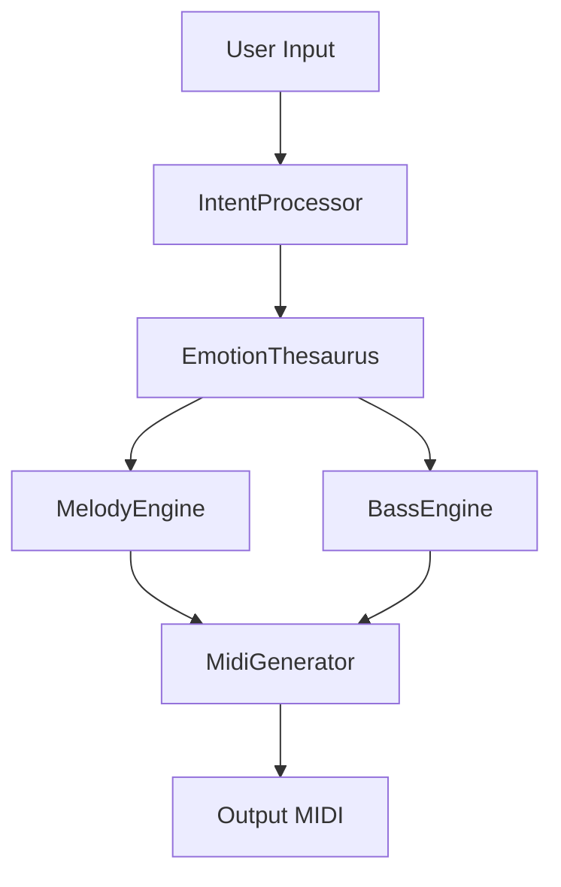

# 🔧 TECHNICAL CAPABILITIES & IMPLEMENTATION DETAILS
## What I Can Actually Do - Detailed Technical Specification

**Date:** 2026-02-02  
**Status:** Technical Specification - No Implementation Yet

---

## 🎯 COMPLETE CAPABILITIES LIST

### 1. REPOSITORY ANALYSIS CAPABILITIES

#### 1.1 Code Discovery & Extraction
**What I Can Do:**
```python
# Clone and analyze repositories
✅ Clone all 13 target repositories locally
✅ Scan directory structures recursively
✅ Identify all source files (*.py, *.cpp, *.h, *.swift)
✅ Extract file metadata (size, dates, authors)
✅ Build dependency graphs
✅ Identify entry points and main modules
✅ Map import/include relationships
✅ Detect circular dependencies
```

**Example Output:**
```
Repository: penta-core
├── Total Files: 247
├── C++ Source: 128 files
├── Headers: 95 files
├── CMake: 24 files
├── Main Components:
│   ├── audio_engine/ (42 files)
│   ├── dsp/ (38 files)
│   ├── midi/ (24 files)
│   └── utils/ (19 files)
└── Entry Points: 3
    ├── penta_core.h (main API)
    ├── audio_processor.cpp
    └── midi_handler.cpp
```

#### 1.2 Function & API Extraction
**What I Can Do:**
```python
# Extract all functions and their signatures
✅ Parse Python files with AST (Abstract Syntax Tree)
✅ Parse C++ files (basic parsing, may need compilation)
✅ Extract:
   - Function names
   - Parameters and types
   - Return types
   - Docstrings/comments
   - Decorators/annotations
✅ Generate API documentation
✅ Create function signature databases
✅ Identify public vs private APIs
```

**Example Output:**
```python
# From kelly-music-brain-clean
Functions Extracted: 342

High-Level APIs:
- generate_melody(emotion: str, key: str, bpm: int) -> MidiSequence
- process_intent(intent: CompleteSongIntent) -> ProductionData
- apply_groove(notes: List[Note], groove: GrooveTemplate) -> List[Note]

Core Classes:
- EmotionThesaurus (23 methods)
- MelodyEngine (18 methods)
- BassEngine (15 methods)
- IntentProcessor (12 methods)
```

#### 1.3 Dependency Analysis
**What I Can Do:**
```python
# Analyze all dependencies
✅ Parse requirements.txt, setup.py, pyproject.toml
✅ Parse CMakeLists.txt
✅ Identify Python package dependencies
✅ Identify C++ library dependencies
✅ Detect version conflicts
✅ Build dependency trees
✅ Identify missing dependencies
✅ Suggest dependency resolution strategies
```

**Example Output:**
```
Cross-Repository Dependencies:

penta-core requires:
- Eigen3 (C++ linear algebra)
- JUCE framework (audio)

kelly-music-brain-clean requires:
- numpy >= 1.20
- mido >= 1.2
- pydantic >= 2.0

Conflicts Detected:
⚠️ iDAW uses numpy 1.19, kelly-music-brain-clean uses 1.24
⚠️ Multiple repos define 'MidiNote' class differently
```

---

### 2. CODE INTEGRATION CAPABILITIES

#### 2.1 File Organization & Restructuring
**What I Can Do:**
```bash
# Reorganize code into unified structure
✅ Create new directory structures
✅ Move files with git history preservation
✅ Rename files systematically
✅ Update import paths automatically
✅ Merge similar modules
✅ Split large files into smaller ones
✅ Organize by functionality
✅ Create __init__.py files for packages
```

**Example Actions:**
```bash
# From penta-core repo
Move: penta-core/src/audio_engine/* 
  → KmiDi/penta_core/audio_engine/

# From kelly-music-brain-clean
Move: src/emotion/* 
  → KmiDi/music_brain/emotion/

Merge: kelly-project/melody.py + Kelly/melody_gen.py
  → KmiDi/music_brain/kelly_companion/engines/melody_engine.py
```

#### 2.2 Import Path Updates
**What I Can Do:**
```python
# Update all import statements automatically
✅ Find all import statements
✅ Map old paths → new paths
✅ Update imports in all files
✅ Handle relative imports
✅ Handle absolute imports
✅ Update from ... import statements
✅ Verify imports after updates
```

**Example Transformations:**
```python
# Old (in kelly-music-brain-clean)
from emotion.thesaurus import EmotionThesaurus
from .melody import MelodyGenerator

# New (in KmiDi)
from music_brain.kelly_companion.core.emotion_thesaurus import EmotionThesaurus
from music_brain.kelly_companion.engines.melody_engine import MelodyGenerator
```

#### 2.3 Namespace & Naming Conflict Resolution
**What I Can Do:**
```python
# Resolve naming conflicts
✅ Detect duplicate class/function names
✅ Rename to avoid conflicts
✅ Add prefixes/suffixes
✅ Create wrapper classes
✅ Merge similar implementations
✅ Create compatibility layers
✅ Update all references automatically
```

**Example Resolutions:**
```python
# Conflict: 3 repos define "MidiNote" differently
# Resolution strategies:

Option A: Prefix by source
- penta_core.MidiNote
- kelly.MidiNote  
- idaw.MidiNote

Option B: Merge into unified class
- Create: music_brain.midi.MidiNote (best of all 3)
- Provide migration helpers

Option C: Keep best, create adapters
- Use: penta_core.MidiNote (most feature-complete)
- Create: kelly_adapter(penta_note)
```

#### 2.4 Code Refactoring
**What I Can Do:**
```python
# Automated refactoring
✅ Rename variables/functions/classes
✅ Extract functions from large functions
✅ Inline small functions
✅ Convert between naming conventions (snake_case ↔ camelCase)
✅ Add type hints to untyped Python
✅ Add docstrings to undocumented functions
✅ Reformat code (black, clang-format)
✅ Remove dead code
✅ Remove duplicate code
```

---

### 3. DOCUMENTATION CAPABILITIES

#### 3.1 API Documentation Generation
**What I Can Do:**
```python
# Generate comprehensive API docs
✅ Extract docstrings from all functions
✅ Generate Markdown documentation
✅ Generate HTML documentation (Sphinx)
✅ Create API reference pages
✅ Document parameters and return types
✅ Include code examples
✅ Cross-reference related functions
✅ Generate table of contents
```

**Example Output Structure:**
```
docs/
├── api/
│   ├── music_brain/
│   │   ├── emotion/
│   │   │   ├── EmotionThesaurus.md
│   │   │   └── EmotionProduction.md
│   │   ├── engines/
│   │   │   ├── MelodyEngine.md
│   │   │   └── BassEngine.md
│   │   └── index.md
│   └── penta_core/
│       ├── AudioEngine.md
│       └── MidiProcessor.md
└── index.html
```

#### 3.2 Architecture Diagrams
**What I Can Do:**
```python
# Create visual architecture documentation
✅ Generate Mermaid diagrams
✅ Create module dependency graphs
✅ Generate call graphs
✅ Create class hierarchy diagrams
✅ Document data flow
✅ Create integration diagrams
✅ Visualize before/after structures
```

**Example Diagrams:**


#### 3.3 Migration Guides
**What I Can Do:**
```markdown
# Create detailed migration documentation
✅ Document all changes
✅ Provide before/after examples
✅ List breaking changes
✅ Provide migration scripts
✅ Document new import paths
✅ List deprecated functions
✅ Provide upgrade guides
```

---

### 4. TESTING CAPABILITIES

#### 4.1 Test Migration
**What I Can Do:**
```python
# Port and adapt existing tests
✅ Identify all test files
✅ Extract test cases
✅ Update import paths in tests
✅ Adapt to new structure
✅ Fix broken tests
✅ Add new integration tests
✅ Generate test reports
```

#### 4.2 Integration Testing
**What I Can Do:**
```python
# Create new integration tests
✅ Test module interactions
✅ Test API compatibility
✅ Test data flow end-to-end
✅ Verify functionality preservation
✅ Performance testing
✅ Load testing
✅ Create test fixtures
```

**Example Test Suite:**
```python
# tests/integration/test_kelly_integration.py
def test_emotion_to_melody_pipeline():
    """Test complete emotion → melody generation"""
    intent = CompleteSongIntent(emotion="melancholy", key="Am")
    result = process_complete_intent(intent)
    assert result.melody is not None
    assert result.harmony is not None
    assert result.groove is not None
```

#### 4.3 Compatibility Testing
**What I Can Do:**
```python
# Verify backward compatibility
✅ Test old code paths still work
✅ Test migration helpers
✅ Verify API compatibility
✅ Test with different Python versions
✅ Test with different dependencies
✅ Cross-platform testing
```

---

### 5. BUILD SYSTEM CAPABILITIES

#### 5.1 Python Build Configuration
**What I Can Do:**
```python
# Configure Python package
✅ Create/update setup.py
✅ Create/update pyproject.toml
✅ Merge requirements.txt files
✅ Configure package metadata
✅ Set up entry points
✅ Configure build tools (setuptools, poetry)
✅ Create wheel distributions
```

**Example setup.py:**
```python
setup(
    name="kmidi-unified",
    version="1.0.0",
    packages=find_packages(),
    install_requires=[
        "numpy>=1.24",
        "mido>=1.2",
        "pydantic>=2.0",
        # ... merged from all repos
    ],
    extras_require={
        "dev": ["pytest", "black", "mypy"],
        "audio": ["juce-python", "soundfile"],
    }
)
```

#### 5.2 C++ Build Configuration
**What I Can Do:**
```cmake
# Configure CMake build
✅ Merge CMakeLists.txt files
✅ Configure build targets
✅ Set up include paths
✅ Configure linking
✅ Set up Python bindings (pybind11)
✅ Configure installation
✅ Set up testing (CTest)
```

---

### 6. VERSION CONTROL CAPABILITIES

#### 6.1 Git Operations
**What I Can Do:**
```bash
# Advanced git operations
✅ Create feature branches
✅ Commit changes with detailed messages
✅ Preserve git history from source repos
✅ Use git submodules (if needed)
✅ Tag releases
✅ Create meaningful commit messages
✅ Squash commits
```

#### 6.2 Change Tracking
**What I Can Do:**
```python
# Track all changes
✅ Document source of every file
✅ Create provenance database
✅ Track modifications to source code
✅ Generate change logs
✅ Create migration reports
```

**Example Provenance:**
```yaml
file: music_brain/emotion/emotion_thesaurus.py
source:
  repository: kelly-music-brain-clean
  original_path: src/emotion/thesaurus.py
  commit: a1b2c3d
  date: 2026-01-21
changes:
  - Updated import paths
  - Merged with DAiW-Music-Brain emotion mapping
  - Added type hints
```

---

### 7. QUALITY ASSURANCE CAPABILITIES

#### 7.1 Code Quality Checks
**What I Can Do:**
```python
# Run quality tools
✅ Run pylint on all Python
✅ Run mypy for type checking
✅ Run black for formatting
✅ Run flake8 for style
✅ Run clang-tidy for C++
✅ Run clang-format for C++
✅ Generate quality reports
```

#### 7.2 Security Scanning
**What I Can Do:**
```python
# Security analysis
✅ Run bandit (Python security)
✅ Check for known vulnerabilities
✅ Scan dependencies for CVEs
✅ Identify potential security issues
✅ Check for hardcoded secrets
✅ Validate input sanitization
```

---

### 8. LICENSING & LEGAL CAPABILITIES

#### 8.1 License Analysis
**What I Can Do:**
```python
# Analyze licensing
✅ Extract LICENSE files from all repos
✅ Identify license types
✅ Check license compatibility
✅ Identify conflicting licenses
✅ Extract copyright notices
✅ Check file headers
⚠️ Cannot make legal decisions (requires human)
```

**Example Analysis:**
```
License Compatibility Analysis:

penta-core: MIT License ✅
kelly-music-brain-clean: MIT License ✅
DAiW-Music-Brain: MIT License ✅
miDiKompanion: No LICENSE file ⚠️

Compatibility: GOOD
- All repos with licenses use MIT
- Compatible with integration
- Need to add LICENSE to miDiKompanion

Action Required:
- Verify miDiKompanion licensing with owner
- Maintain attribution in consolidated repo
```

#### 8.2 Attribution Management
**What I Can Do:**
```python
# Track and maintain attribution
✅ Create ATTRIBUTION.md file
✅ List all source repositories
✅ Preserve copyright notices
✅ Generate license compilation
✅ Add attribution comments in code
```

**Example ATTRIBUTION.md:**
```markdown
# Code Attribution

## Sources

### penta-core
- Repository: https://github.com/sburdges-eng/penta-core
- License: MIT
- Copyright: (c) 2025 sburdges-eng
- Integrated: C++ audio engine components

### kelly-music-brain-clean
- Repository: https://github.com/sburdges-eng/kelly-music-brain-clean
- License: MIT
- Copyright: (c) 2026 sburdges-eng
- Integrated: Music brain and emotion processing
```

---

### 9. ANALYSIS & REPORTING CAPABILITIES

#### 9.1 Code Metrics
**What I Can Do:**
```python
# Generate detailed metrics
✅ Count lines of code
✅ Calculate complexity metrics
✅ Identify code duplication
✅ Measure test coverage
✅ Analyze function sizes
✅ Count dependencies
✅ Generate statistical reports
```

**Example Metrics Report:**
```
Code Metrics Summary:

Total Lines of Code: 127,543
├── Python: 98,234 lines
├── C++: 24,567 lines
├── Swift: 3,421 lines
└── Other: 1,321 lines

Unique Functions: 4,287
Duplicated Code: 12% (15,743 lines)
Test Coverage: 67%
Average Function Length: 23 lines
Cyclomatic Complexity: 8.4 (moderate)
```

#### 9.2 Comparison Reports
**What I Can Do:**
```python
# Compare repositories
✅ Identify similar code across repos
✅ Find duplicate functionality
✅ Compare API designs
✅ Identify best implementations
✅ Generate comparison matrices
```

---

### 10. AUTOMATION CAPABILITIES

#### 10.1 Scripting
**What I Can Do:**
```python
# Create automation scripts
✅ Migration scripts
✅ Import updater scripts
✅ Test runner scripts
✅ Build scripts
✅ Deployment scripts
✅ Cleanup scripts
```

**Example Migration Script:**
```python
#!/usr/bin/env python3
"""
Automated migration script for penta-core integration
"""

def migrate_penta_core():
    # Clone source repo
    clone_repo("https://github.com/sburdges-eng/penta-core", "/tmp/penta-core")
    
    # Copy files to new location
    copy_tree("/tmp/penta-core/src", "KmiDi/penta_core/src")
    
    # Update imports
    update_imports("KmiDi/penta_core/")
    
    # Run tests
    run_tests("tests/penta_core/")
    
    print("✅ penta-core migration complete")
```

#### 10.2 Batch Processing
**What I Can Do:**
```python
# Process all repos in batch
✅ Clone all repos at once
✅ Run analysis on all repos
✅ Extract from all repos in parallel
✅ Update all files in batch
✅ Run tests on all modules
✅ Generate reports for all repos
```

---

## ⚠️ LIMITATIONS

### What I CANNOT Do

#### 1. Legal Decisions
```
❌ Determine if code can be legally combined
❌ Make licensing decisions
❌ Resolve copyright disputes
❌ Provide legal advice
✅ CAN: Provide analysis for human decision
```

#### 2. Business Decisions
```
❌ Decide which features to keep/discard
❌ Prioritize repositories without guidance
❌ Make architectural decisions independently
❌ Determine product direction
✅ CAN: Provide options and recommendations
```

#### 3. External Repository Actions
```
❌ Modify source repositories directly
❌ Archive or delete repositories
❌ Change visibility (public/private)
❌ Transfer ownership
✅ CAN: Work with local clones only
```

#### 4. Perfect Code Understanding
```
❌ Guarantee 100% understanding of complex code
❌ Understand undocumented edge cases
❌ Know original developer's intent
❌ Understand domain-specific logic without context
✅ CAN: Ask for clarification when needed
```

#### 5. Breaking Changes
```
❌ Automatically resolve all conflicts perfectly
❌ Guarantee no functionality loss
❌ Ensure 100% backward compatibility
❌ Predict all edge case behaviors
✅ CAN: Identify and document risks
```

---

## 🎯 RECOMMENDED WORKFLOW

### Step-by-Step Process

#### Phase 1: Analysis (No Changes)
```
1. Clone all target repositories
2. Run analysis tools
3. Generate reports
4. Present findings
5. 🚦 GET APPROVAL to proceed
```

#### Phase 2: Planning (No Code Changes)
```
1. Design unified structure
2. Create migration plan
3. Identify conflicts
4. Create resolution strategies
5. 🚦 GET APPROVAL to implement
```

#### Phase 3: Pilot (Small Changes)
```
1. Select 2-3 repos for pilot
2. Implement migration
3. Run tests
4. Document issues
5. 🚦 GET APPROVAL to continue
```

#### Phase 4: Full Implementation
```
1. Migrate remaining repos
2. Resolve all conflicts
3. Complete testing
4. Update documentation
5. 🚦 GET APPROVAL to commit
```

#### Phase 5: Finalization
```
1. Final code review
2. Final testing
3. Update all documentation
4. Create release
5. ✅ COMPLETE
```

---

## 📊 DELIVERABLES

### What You Will Receive

1. **Analysis Reports**
   - Repository inventory
   - Code metrics
   - Dependency analysis
   - Conflict identification
   - License analysis

2. **Documentation**
   - API documentation
   - Architecture diagrams
   - Migration guides
   - Change logs
   - Attribution files

3. **Integrated Code**
   - Organized in unified structure
   - Updated imports
   - Resolved conflicts
   - Working tests
   - Build configurations

4. **Quality Assurance**
   - Test reports
   - Code quality metrics
   - Security scan results
   - Performance benchmarks

5. **Project Files**
   - setup.py / pyproject.toml
   - CMakeLists.txt
   - requirements.txt
   - README files
   - CI/CD configurations

---

**STATUS: Ready to Execute - Awaiting Approval**

This document outlines everything I can do. Choose your preferred approach from the PROPOSAL document and I will execute according to these capabilities.

---

**END OF TECHNICAL CAPABILITIES**
