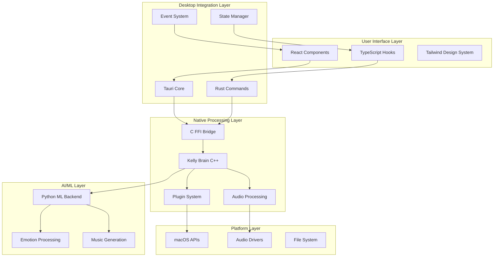
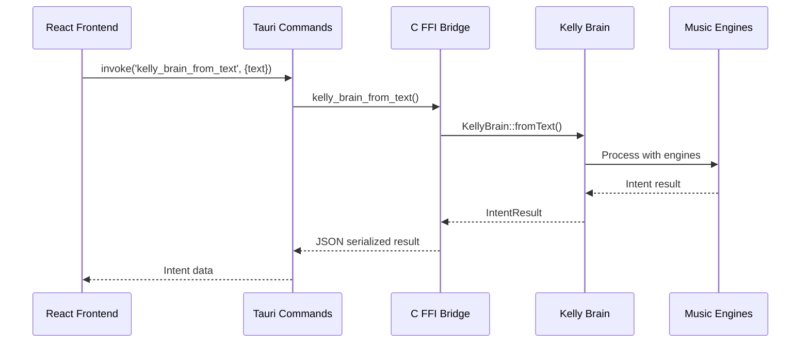
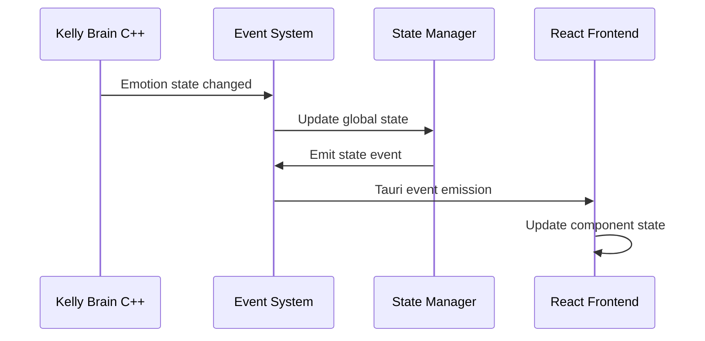
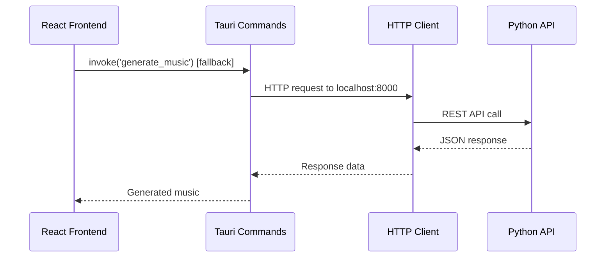
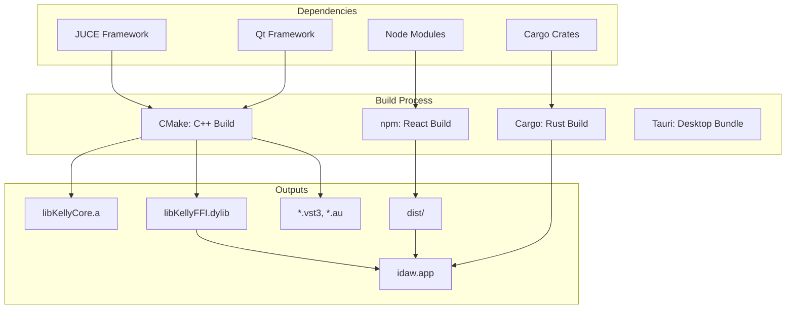
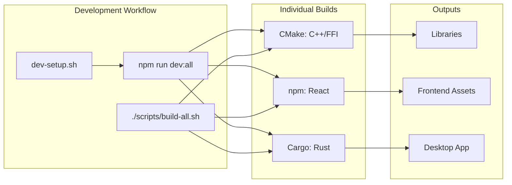

# KmiDi Multi-Technology Architecture

**Version:** 1.0  
**Updated:** 2026-01-18  
**Purpose:** Complete architecture reference for KmiDi's integrated technology stack

## Overview

KmiDi is a sophisticated digital audio workstation that integrates 5 major technologies to create a seamless emotion-driven music production environment:

1. **React/TypeScript** - Modern responsive user interface
2. **Tauri/Rust** - Desktop integration and inter-process communication
3. **C++/JUCE** - Real-time audio processing and plugin architecture
4. **Python** - Machine learning and AI music generation
5. **Native macOS/Linux** - Platform-specific integrations

## Architecture Diagram



## Technology Stack Details

### React/TypeScript Frontend

**Location:** `src/components/`, `src/hooks/`, `src/App.tsx`

**Responsibilities:**
- User interface and interaction
- Emotion selection and parameter control
- Real-time state visualization
- Documentation and guide navigation
- Music generation controls

**Key Components:**
- `EmotionWheel.tsx` - 3-tier emotion selection interface
- `useKellyBrain.ts` - Direct C++ backend integration hook
- `useMusicBrain.ts` - Hybrid C++/Python API integration
- `SpectoCloudPanel.tsx` - Music visualization component

**Technologies:**
- React 19.1.0 with modern hooks
- TypeScript 5.8 strict mode
- Tailwind CSS 4.x design system
- Vite 7.x build system

### Tauri/Rust Desktop Layer

**Location:** `src-tauri/`

**Responsibilities:**
- Desktop application framework
- Inter-process communication (IPC)
- Foreign Function Interface (FFI) to C++
- Event management and state synchronization
- File system and OS integration

**Key Components:**
- `commands.rs` - Tauri command definitions for C++ integration
- `bridge/kelly_ffi.rs` - Safe Rust wrappers around C FFI
- `state.rs` - Global state management and synchronization
- `events.rs` - Real-time event system for UI updates

**Technologies:**
- Tauri 2.x desktop framework
- Rust 1.70+ with async/await
- FFI bindings with memory safety
- Broadcast channels for real-time events

### C++/JUCE Native Core

**Location:** `src/engine/`, `src/dsp/`, `src/audio/`, `cpp_music_brain/`

**Responsibilities:**
- Real-time audio processing
- Kelly Brain AI music generation
- Emotion-to-music mapping
- MIDI processing and generation
- Plugin architecture (VST3/AU/CLAP)

**Key Components:**
- `KellyBrain.h/.cpp` - Main AI orchestration system
- `EmotionThesaurus.h/.cpp` - Emotion mapping and processing
- `src/engines/` - 24 specialized music generation engines
- `src/bridge/kelly_ffi.h/.cpp` - C FFI interface for external integration

**Technologies:**
- C++20 with modern features
- JUCE 7.0.9 audio framework
- CMake 3.27 build system
- SIMD optimizations (AVX2/FMA)

### Python ML Backend

**Location:** `music_brain/`, `scripts/`, `penta_core/`

**Responsibilities:**
- Machine learning model inference
- Advanced emotion analysis
- Training data processing
- Web API for external integration

**Key Components:**
- `music_brain/api.py` - REST API server
- `penta_core/` - Core ML processing library
- Training and evaluation scripts
- Model management and deployment

**Technologies:**
- Python 3.9+ with async support
- PyBind11 for C++ integration
- FastAPI for web services
- Various ML frameworks (PyTorch, etc.)

## Data Flow Architecture

### Primary Flow: React → C++ Direct



### Real-time State Updates



### Fallback Flow: React → Python HTTP



## Kelly Emotion-to-Music Pipeline (Magenta + Stem-JEPA Integration)

```
┌─────────────────────────────────────────────────────────────────────────────┐
│                         KELLY EMOTION-TO-MUSIC PIPELINE                     │
├─────────────────────────────────────────────────────────────────────────────┤
│                                                                             │
│  ┌─────────────┐    ┌─────────────────┐    ┌─────────────────────────────┐ │
│  │   INPUT     │    │  EMOTION LAYER  │    │      GENERATION LAYER       │ │
│  │             │    │                 │    │                             │ │
│  │ • Biometric │───▶│ VADState        │───▶│  MusicVAE Latent Mapping   │ │
│  │ • Text      │    │ (V,A,D vector)  │    │  ┌─────────────────────┐   │ │
│  │ • Audio     │    │                 │    │  │ z = z_base +        │   │ │
│  │ • Manual    │    │ Trend Analysis  │    │  │   α_V·ΔV + α_A·ΔA + │   │ │
│  └─────────────┘    │ (C++ analyzer)  │    │  │   α_D·ΔD            │   │ │
│                     └────────┬────────┘    │  └─────────────────────┘   │ │
│                              │             │              │              │ │
│                              ▼             │              ▼              │ │
│                     ┌─────────────────┐    │  ┌─────────────────────┐   │ │
│                     │ Emotion-Stem    │    │  │ MusicVAE Decoder    │   │ │
│                     │ Affinity Matrix │    │  │ (Hierarchical LSTM) │   │ │
│                     │                 │    │  └──────────┬──────────┘   │ │
│                     │ grief→strings   │    │             │              │ │
│                     │ joy→upbeat drums│    │             ▼              │ │
│                     │ anger→distorted │    │  ┌─────────────────────┐   │ │
│                     └────────┬────────┘    │  │   NoteSequence      │   │ │
│                              │             │  │   (Magenta format)  │   │ │
│                              ▼             │  └──────────┬──────────┘   │ │
│                     ┌─────────────────┐    │             │              │ │
│                     │   STEM-JEPA     │    │             ▼              │ │
│                     │   RETRIEVAL     │◀───┼──│ Chord Predictor     │   │ │
│                     │                 │    │  │ (LSTM + Markov)     │   │ │
│                     │ Context Encoder │    │  └─────────────────────┘   │ │
│                     │ (ViT-Base 768d) │    │                            │ │
│                     │       │         │    └─────────────────────────────┘ │
│                     │       ▼         │                                    │
│                     │ FiLM Predictor  │    ┌─────────────────────────────┐ │
│                     │ (6-layer MLP)   │    │     HUMANIZATION LAYER      │ │
│                     │       │         │    │                             │ │
│                     │       ▼         │    │  ┌─────────────────────┐   │ │
│                     │ Stem Ranking    │───▶│  │ EmotionHumanizer    │   │ │
│                     │ (L2 distance)   │    │  │                     │   │ │
│                     └─────────────────┘    │  │ VAD → timing params │   │ │
│                                            │  │ • swing amount      │   │ │
│                                            │  │ • velocity variance │   │ │
│                                            │  │ • micro-timing      │   │ │
│                                            │  └──────────┬──────────┘   │ │
│                                            │             │              │ │
│                                            │             ▼              │ │
│                                            │  ┌─────────────────────┐   │ │
│                                            │  │   MIDI Output       │   │ │
│                                            │  │   (mido messages)   │   │ │
│                                            │  └─────────────────────┘   │ │
│                                            └─────────────────────────────┘ │
└─────────────────────────────────────────────────────────────────────────────┘
```

### Data Flow

```
User Emotion Input
       │
       ▼
┌──────────────────┐
│    VADState      │ valence: -1.0 to 1.0 (negative→positive)
│  (3D vector)     │ arousal:  0.0 to 1.0 (calm→excited)
│                  │ dominance: 0.0 to 1.0 (weak→powerful)
└────────┬─────────┘
         │
    ┌────┴────┬──────────────┬────────────────┐
    │         │              │                │
    ▼         ▼              ▼                ▼
┌────────┐ ┌────────┐ ┌───────────┐ ┌──────────────┐
│Latent  │ │Stem    │ │Humanize   │ │Chord         │
│Mapping │ │Affinity│ │Params     │ │Progression   │
└───┬────┘ └───┬────┘ └─────┬─────┘ └──────┬───────┘
    │          │            │              │
    ▼          ▼            ▼              ▼
┌────────┐ ┌────────┐ ┌───────────┐ ┌──────────────┐
│MusicVAE│ │StemJEPA│ │Timing +   │ │Resolution    │
│Decode  │ │Retrieve│ │Velocity   │ │Cadence       │
└───┬────┘ └───┬────┘ └─────┬─────┘ └──────┬───────┘
    │          │            │              │
    └──────────┴────────────┴──────────────┘
                     │
                     ▼
           ┌─────────────────┐
           │  Humanized MIDI │
           │  NoteSequence   │
           └─────────────────┘
```

### Key Components

#### 1. VAD-to-Latent Mapping (MusicVAE)
```text
# Attribute vector arithmetic
z_target = z_base + α_V*(z_HV - z_LV) + α_A*(z_HA - z_LA) + α_D*(z_HD - z_LD)

# Where:
# z_HV, z_LV = high/low valence centroids from EMOPIA
# α_V, α_A, α_D = scaled VAD coordinates
```

#### 2. Stem-JEPA FiLM Conditioning
```text
# FiLM modulation per layer
h_l+1 = σ(γ_l ⊙ (W_l · h_l) + β_l)

# Where γ, β derived from:
conditioning = [instrument_embedding | emotion_modulation]
```

#### 3. Emotion Humanization Mapping
```
VAD State          →    Humanization Parameters
─────────────────────────────────────────────────
High Arousal       →    Tight timing, high velocity variance
Low Arousal        →    More swing, compressed dynamics
Positive Valence   →    Slight forward push (anticipation)
Negative Valence   →    Slight drag (behind beat)
High Dominance     →    Stronger downbeats
Low Dominance      →    More even dynamics
```

### Integration Points

#### Python kellymidicompanion ↔ Magenta
```python
# Conversion layer
NoteSequenceConverter:
    midi_file_to_notesequence(path) → NoteSequence
    notesequence_to_midi_file(seq, path)
    mido_messages_to_notesequence(msgs) → NoteSequence
    notesequence_to_mido_messages(seq) → List[mido.Message]
```

#### C++ VAD Analyzer ↔ Python Pipeline
```cpp
// C++ produces TrendPrediction
struct TrendPrediction {
    VADState predictedState;
    float confidence;
    float trendStrength;
    std::string trendDescription;
};
```

```python
# Python consumes via EmotionState from music_brain.intent_ir:
from music_brain.intent_ir import EmotionState

emotion = EmotionState(valence=..., arousal=..., dominance=...)
```

#### Stem-JEPA ↔ MusicVAE Latent Space
```
Both use high-dimensional embeddings (512-768 dim)
Bridge via emotion-to-affinity mapping:
    VAD → emotion weights → stem affinity scores → candidate ranking
```

### Latency Targets

| Component | Target | Actual (GPU) | Actual (CPU) |
|-----------|--------|--------------|--------------|
| VAD Analysis | <5ms | 1-2ms | 2-5ms |
| MusicVAE encode | <100ms | 50-100ms | 500-1000ms |
| MusicVAE decode | <100ms | 50-100ms | 500-1000ms |
| Stem-JEPA encode | <200ms | 100-200ms | 1-2s |
| Humanization | <10ms | 2-5ms | 5-10ms |
| MIDI conversion | <5ms | 1-2ms | 2-5ms |
| **End-to-end** | **<500ms** | **~300ms** | **~3s** |

### Dependencies

```
# Core
Python 3.9 (for Magenta compatibility)
TensorFlow 2.x (via compat.v1)
PyTorch 2.x (for Stem-JEPA)

# Audio/MIDI
note-seq >= 0.0.5
mido >= 1.2.0
librosa >= 0.10.0

# ML
numpy >= 1.21.0
scipy >= 1.7.0

# Kelly-specific
music21 >= 8.0.0  # Chord analysis
pretty_midi >= 0.2.9
```

### Model Checkpoints

| Model | Size | Source | License |
|-------|------|--------|---------|
| MusicVAE mel_2bar | 13MB | gs://magentadata/ | Apache 2.0 |
| MusicVAE hierdec_mel_16bar | 880MB | gs://magentadata/ | Apache 2.0 |
| GrooVAE 2bar_humanize | 50MB | gs://magentadata/ | Apache 2.0 |
| Stem-JEPA ViT-Base | ~350MB | GitHub/SonyCSL | Research |

### File Structure (Proposed)

> **Note:** This is a proposed structure for future Magenta/Stem-JEPA integration. Most of these files do not yet exist in the repository.

```
KmiDi/
├── music_brain/
│   ├── intent_ir/                 # Existing: EmotionState definition
│   ├── integrations/              # Existing: dynamics_integration.py
│   ├── emotion/                   # Existing emotion modules
│   ├── generation/                # Proposed:
│   │   ├── magenta_integration.py # Planned integration layer
│   │   └── stem_jepa_integration.py # Planned integration layer
│   └── humanization/              # Proposed:
│       └── emotion_humanizer.py   # Planned humanization
├── penta_core/                    # Existing C++ RT engine
│   └── include/penta/dynamics/    # C++ EmotionState/VAD types
└── models/                        # Proposed checkpoint storage
    ├── musicvae/
    │   └── checkpoints/
    ├── groovae/
    │   └── checkpoints/
    └── stem_jepa/
        └── checkpoints/
```

### Quick Start

> **Note:** This is pseudocode for planned Magenta/Stem-JEPA integration APIs. These modules do not yet exist.

```python
# Pseudocode for planned integration
from music_brain.generation.magenta_integration import (
    VADLatentMapper,
    EmotionHumanizer,
    NoteSequenceConverter
)
from music_brain.generation.stem_jepa_integration import (
    EmotionStemPipeline,
    StemCategory
)
from music_brain.intent_ir import EmotionState

# 1. Define emotional intent (using existing EmotionState type)
grief = EmotionState(valence=-0.6, arousal=0.3, dominance=0.4)

# 2. Get stem recommendations
pipeline = EmotionStemPipeline()
recs = pipeline.recommend_stems(
    context_spectrogram,
    grief,
    available_stems=[StemCategory.STRINGS, StemCategory.PIANO, StemCategory.DRUMS]
)

# 3. Generate with MusicVAE
mapper = VADLatentMapper()
latent_offset = mapper.vad_to_latent_offset(grief)
# ... feed to MusicVAE decoder

# 4. Humanize output
humanizer = EmotionHumanizer()
humanized = humanizer.humanize_notesequence(generated_sequence, grief)

# 5. Export to MIDI
converter = NoteSequenceConverter()
converter.notesequence_to_midi_file(humanized, "output.mid")
```

## Integration Patterns

### 1. FFI Bridge Pattern

The C FFI bridge provides a stable interface between C++ and Rust:

**C++ Side:**
```cpp
// src/bridge/kelly_ffi.h
extern "C" {
    KellyBrain* kelly_brain_create();
    char* kelly_brain_from_text(KellyBrain* brain, const char* text);
    void kelly_brain_destroy(KellyBrain* brain);
}
```

**Rust Side:**
```rust
// src-tauri/src/bridge/kelly_ffi.rs
#[link(name = "KellyFFI")]
extern "C" {
    fn kelly_brain_create() -> *mut KellyBrainHandle;
    fn kelly_brain_from_text(brain: *mut KellyBrainHandle, text: *const c_char) -> *mut c_char;
    fn kelly_brain_destroy(brain: *mut KellyBrainHandle);
}
```

### 2. State Synchronization Pattern

State is managed across three layers:

1. **C++ State** - Authoritative source (KellyBrain internal state)
2. **Rust State** - Cached copy with thread-safe access
3. **React State** - UI-optimized copy with immediate updates

### 3. Event-Driven Updates

Real-time updates flow through an event system:

```rust
// C++ emits events
kelly_event_callback("emotion_changed", emotion_json, user_data);

// Rust receives and forwards
manager.emit(KellyEvent::EmotionUpdate { valence, arousal, dominance });

// React listens and updates
await listen('kelly-emotion-update', (event) => {
  setEmotionState(event.payload);
});
```

## Build System Architecture

### Multi-Technology Build Pipeline



### Build Dependencies

```bash
# System dependencies
cmake >= 3.27
rustc >= 1.70
node >= 18.0
python >= 3.9

# C++ dependencies (via CMake FetchContent)
JUCE 7.0.9
Qt6 Core/Widgets
readerwriterqueue
fmt, spdlog, Catch2

# Rust dependencies (via Cargo)
tauri 2.0
serde, serde_json
tokio, reqwest, chrono

# Node dependencies (via npm)
React 19.1.0, TypeScript 5.8
Tailwind CSS 4.x, Vite 7.x
```

## File Organization

### Project Structure

```
KmiDi/
├── src/                          # C++ implementation
│   ├── engine/                   # Kelly Brain AI (50+ components)
│   ├── engines/                  # Musical engines (24 engines)
│   ├── dsp/                      # DSP primitives
│   ├── audio/                    # Audio I/O and analysis
│   ├── bridge/                   # FFI interface
│   ├── plugin/                   # VST3/AU plugin implementations
│   ├── components/               # React components
│   └── hooks/                    # React hooks
│
├── src-tauri/                    # Rust desktop integration
│   ├── src/
│   │   ├── commands.rs           # Tauri command definitions
│   │   ├── bridge/               # Rust FFI bindings
│   │   ├── state.rs              # State management
│   │   └── events.rs             # Event system
│   ├── build.rs                  # Build configuration
│   └── tauri.conf.json           # Tauri app configuration
│
├── cpp_music_brain/              # Modular C++ architecture
│   ├── src/                      # Modular implementations
│   ├── tests/                    # C++ test suite
│   └── CMakeLists.txt            # Modular build system
│
├── music_brain/                  # Python ML backend
├── scripts/                      # Build and development scripts
├── docs/                         # Documentation
├── CMakeLists.txt                # Root build configuration
└── package.json                  # Node.js configuration
```

### Component Responsibilities

| Component | Technology | Responsibility |
|-----------|------------|----------------|
| **UI Components** | React/TypeScript | User interaction, visualization |
| **Hooks** | React/TypeScript | State management, API integration |
| **Tauri Commands** | Rust | IPC, FFI bridging, desktop APIs |
| **FFI Bridge** | C | Language interoperability layer |
| **Kelly Brain** | C++ | AI music generation orchestration |
| **Music Engines** | C++ | Specialized music processing |
| **Audio Core** | C++/JUCE | Real-time audio processing |
| **Plugin System** | C++/JUCE | VST3/AU/CLAP implementations |
| **ML Backend** | Python | Machine learning inference |

## Performance Architecture

### Real-time Constraints

**Audio Thread (C++):**
- No allocations in audio processing
- < 10ms processing time for 512 samples @ 48kHz
- SIMD optimizations for critical paths
- Lock-free data structures

**UI Thread (React):**
- < 100ms response to user input
- < 16ms render budget (60fps)
- Throttled updates from C++ backend
- Async operations for non-critical tasks

**IPC Layer (Rust/FFI):**
- < 1ms FFI call overhead
- Zero-copy serialization where possible
- Background state synchronization
- Event coalescing for high-frequency updates

### Memory Management

**C++ Layer:**
- RAII for automatic resource management
- Pre-allocated buffers for real-time processing
- Smart pointers for safe memory management
- Thread-safe reference counting

**Rust Layer:**
- Ownership system prevents memory errors
- Arc/Mutex for thread-safe shared state
- Automatic cleanup on Drop
- Safe FFI wrappers with lifetime management

**React Layer:**
- Automatic garbage collection
- React 19 automatic batching
- Memoization for expensive computations
- Effect cleanup for event listeners

## Security Architecture

### Sandboxing and Permissions

**Tauri Security:**
- Content Security Policy (CSP) configuration
- API allowlist for restricted access
- File system access controls
- Network access restrictions

**Plugin Security:**
- Audio thread isolation
- Parameter validation
- Host compatibility checks
- Memory boundary enforcement

### Data Protection

**Sensitive Data:**
- User lyrics stored locally only
- Emotion data processed locally
- No cloud transmission of personal data
- Secure local storage for preferences

## Development Architecture

### Build System Integration



### Testing Strategy

**Unit Tests:**
- C++: Catch2 framework for core logic
- Rust: Built-in test framework for FFI bindings
- React: Vitest for component testing

**Integration Tests:**
- FFI boundary testing (C++ ↔ Rust)
- Command integration (Rust ↔ React)
- End-to-end workflow testing

**Performance Tests:**
- Audio processing benchmarks
- UI responsiveness testing
- Memory usage profiling
- Plugin validation in DAW hosts

## Deployment Architecture

### Distribution Formats

**Standalone Desktop App:**
- macOS: `idaw.app` bundle with embedded dependencies
- Linux: AppImage with bundled libraries
- Windows: MSI installer with runtime dependencies

**Audio Plugins:**
- VST3: `KellyPlugin.vst3` for all major DAWs
- Audio Unit: `KellyPlugin.component` for Logic Pro/GarageBand
- CLAP: `KellyPlugin.clap` for modern plugin hosts

**Development Distribution:**
- Source code with build scripts
- Complete development environment setup
- Comprehensive documentation and examples

### Runtime Dependencies

**Embedded in App:**
- Kelly FFI library (`libKellyFFI.dylib/so`)
- React frontend assets (bundled by Vite)
- Tauri runtime and system integration

**External Dependencies:**
- Audio drivers (Core Audio, ALSA, JACK)
- System libraries (managed by package managers)
- Python runtime (for ML features)

## Extension Architecture

### Adding New Features

**C++ Features:**
1. Implement in appropriate `src/` module
2. Add FFI wrapper in `kelly_ffi.cpp`
3. Add Rust binding in `kelly_ffi.rs`
4. Add Tauri command in `commands.rs`
5. Add React hook integration

**UI Features:**
1. Create React component in `src/components/`
2. Add TypeScript interfaces
3. Integrate with existing hooks
4. Update styling with Tailwind tokens

**ML Features:**
1. Implement in Python backend
2. Add HTTP API endpoint
3. Add Tauri command wrapper
4. Integrate with React frontend

### Plugin Extension

**New Plugin Format:**
1. Add JUCE plugin configuration in CMakeLists.txt
2. Implement format-specific processor
3. Test in target plugin host
4. Update distribution scripts

## Monitoring and Debugging

### Debug Builds

**C++ Debug:**
- Debug symbols enabled (`-g`)
- AddressSanitizer for memory errors
- Tracy profiling integration (optional)
- Extensive logging with spdlog

**Rust Debug:**
- Debug assertions enabled
- `RUST_LOG=debug` for detailed logging
- Cargo test integration
- FFI boundary validation

**React Debug:**
- Source maps for debugging
- React DevTools integration
- Console logging for Tauri commands
- Hot reload for rapid iteration

### Production Monitoring

**Performance Metrics:**
- Audio thread latency monitoring
- UI responsiveness measurement
- Memory usage tracking
- CPU utilization monitoring

**Error Handling:**
- Structured error reporting across layers
- Crash report collection
- Graceful degradation on failures
- User-friendly error messages

## Future Architecture Considerations

### Scalability

**Multi-core Processing:**
- Parallel music generation engines
- Thread-safe state management
- Lock-free audio processing
- Background ML inference

**Plugin Ecosystem:**
- Third-party plugin SDK
- Standardized emotion API
- Plugin marketplace integration
- Developer documentation

### Platform Expansion

**Mobile Support:**
- React Native for iOS/Android
- Rust-based mobile bridge
- Simplified C++ core for mobile
- Cloud synchronization options

**Web Platform:**
- WebAssembly compilation
- WebGL visualization
- Progressive Web App (PWA)
- Cloud-based ML processing

---

This architecture supports KmiDi's mission of emotion-driven music creation while maintaining professional-grade performance, security, and extensibility.
