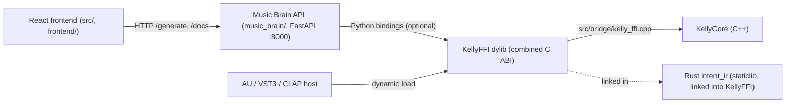

# Full Stack Build and Integration

How the React frontend connects to the native and Python backends, how to build the full stack from this repository, and how to verify plugin builds and integration behavior.

## Architecture: frontend, API, native engine



There is no Tauri desktop shell in the canonical tree. The frontend keeps Tauri-coupled call sites (`IntentBuilder.tsx`: `safeInvoke`, `safeListen`, `__TAURI_INTERNALS__` check) as latent dual-mode capability — in browser builds, `vite.config.ts`'s `tauriStubPlugin` resolves `@tauri-apps/api/*` to no-op stubs, so those paths are inert at runtime.

Reference files:

- `src/components/IntentBuilder.tsx` — `safeInvoke` / `safeListen`, `IS_TAURI` runtime check
- `vite.config.ts` — `tauriStubPlugin` (browser-mode shim for `@tauri-apps/api/*`)
- `engine/intent_ir/src/ffi.rs` — Rust C ABI half (`IntentFrameBuilder_*`, `validate_intent_frame_ffi`)
- `engine/intent_ir/cbindgen.toml` — generates the C header for the Rust ABI half
- `src/bridge/kelly_ffi.h` and `src/bridge/kelly_ffi.cpp` — C++ C ABI half (`kelly_*`)
- `music_brain/api.py` — HTTP endpoints (`/generate`, etc.)

## Build Contexts (Important)

There are two separate plugin/build contexts in this repo:

1. Root project (repo root)
   - CMake options: `BUILD_PLUGINS`, `KMIDI_BUILD_JUCE_UI`, `BUILD_KELLY_FFI`
   - Produces: KellyFFI dylib and `KellyPlugin_VST3`
2. Legacy DAIW project (`KmiDi_FINAL/engine/cpp_music_brain`)
   - CMake options: `DAIW_BUILD_VST3`, `DAIW_BUILD_AU`
   - Produces: legacy DAIW plugin targets (separate pipeline)

Do not mix option names across these two build roots.

## Prerequisites

- CMake 3.27+
- C++ toolchain (Xcode CLT on macOS)
- Node and npm
- Rust toolchain (for `intent_ir` staticlib)
- JUCE available under `external/JUCE` for the root build
- Qt6 for full desktop/plugin surfaces

## Full Stack Build (Root Kelly Project)

From the repository root:

```bash
mkdir -p build
cmake -S . -B build -DCMAKE_BUILD_TYPE=Release -DKMIDI_BUILD_JUCE_UI=ON -DBUILD_PLUGINS=ON -DBUILD_KELLY_FFI=ON
```

### Build the native KellyFFI dylib

```bash
cmake --build build --target KellyFFI -j8
```

Expected output:

- `build/libKellyFFI.dylib` (macOS) — combined C ABI: `kelly_*` (C++) + `IntentFrameBuilder_*` / `validate_intent_frame_ffi` (Rust `intent_ir` staticlib, linked in).

### Build the plugin target

```bash
cmake --build build --target KellyPlugin_VST3 -j8
```

Expected artifact path:

- `build/KellyPlugin_artefacts/Release/VST3/Kelly Emotion Processor.vst3`

### Run the dev stack (React + API)

```bash
npm run dev:all
```

This starts Vite (`localhost:1420`) and the Music Brain API (`uvicorn`, `localhost:8000`) concurrently. The frontend talks to the API over HTTP; Tauri call sites are stubbed in browser mode (see `vite.config.ts`).

## Optional One-Shot Build Helper

```bash
./scripts/build-full-stack.sh
```

Options:

- `--debug` (Debug build type)
- `--no-plugins` (skip `KellyPlugin_VST3`)
- `--build-dir <path>` (custom build dir)

> Note: the script still has a `--no-tauri` / `RUN_TAURI_CHECK` legacy switch. There is no Tauri host in the canonical tree, so the Tauri cargo validation step is a no-op; the flag is harmless and will be removed in a future cleanup.

## On-device LLM (Core ML stateful KV-cache)

For **sub-15 ms/token** greedy decoding on M4 (or compatible Apple Silicon), use the stateful Core ML path:

1. **Export** (requires ExecuTorch elsewhere; not bundled in repo):

   ```bash
   EXECUTORCH_DIR=/path/to/executorch python scripts/export_llm_coreml.py \
     --model-path /path/to/llama-checkpoint --output-dir ./coreml_llm_export
   ```

   This wraps `export_llama_lib.py` with `--coreml-enable-state`, `--coreml-preserve-sdpa`, `--coreml-quantize b4w`, `--disable_dynamic_shape`, `--use_kv_cache`, `--use_sdpa_with_kv_cache`.

2. **Compile** the generated `.mlpackage` to mlmodelc:

   ```bash
   xcrun coremlcompiler compile Model.mlpackage ./build/
   ```

3. **Run** the Swift runner (state-threaded greedy loop):

   ```bash
   cd tools/coreml_llm_runner && swift build -c release
   .build/release/CoreMLLMRunner ./build/Model.mlmodelc --max-tokens 64 --timing
   ```

Stateful prediction requires **macOS 15+ / iOS 18+**. See `tools/coreml_llm_runner/README.md` for usage notes.

**Other optional tools:** MIDI-CI daemon (`-DBUILD_MIDI_CI_DAEMON=ON`, see `tools/midi_ci_daemon/README.md`), PID Flow diagnostic (`penta_core.ml.diagnostics.pid_flow`), latent canonicalization (`penta_core.ml.canonicalize_embeddings`), APSC Wrapper (`penta_core.ml.apsc_wrapper`), and StructXLIP Preprocessor (`penta_core.ml.structxlip`) are documented in `AGENTS.md` under "On-device and alignment tools".

## Integration Testing Procedures

### 1) Rust intent_ir tests

```bash
cd engine/intent_ir
cargo test
```

Exercises the validator, builder, and `extern "C"` symbols on the Rust ABI half (`engine/intent_ir/src/ffi.rs`).

### 2) C++ KellyFFI tests

```bash
cmake -S . -B build -DBUILD_KELLY_FFI=ON -DBUILD_TESTS=ON
cmake --build build --target KellyTests -j8
ctest --test-dir build --output-on-failure
```

Exercises the `kelly_*` ABI half (`tests/cpp/test_kelly_ffi.cpp`).

### 3) Frontend/API contract tests (mocked)

The current e2e file uses mocked invoke responses (fast CI-friendly coverage).

Reference: `tests/e2e/frontend-backend.test.ts`

Run with your project test command (if configured in package scripts), or execute directly with your Vitest setup.

### 4) Live integration sanity procedure (manual)

1. Build `KellyFFI` (per § Build the native KellyFFI dylib).
2. Start the dev stack with `npm run dev:all`.
3. In the UI:
   - submit intent generation from `IntentBuilder`
   - verify the HTTP request to `/generate` completes
   - verify status / progress reflected in the UI

## Plugin Verification Procedures

### A) Compile verification

```bash
cmake --build build --target KellyPlugin_VST3 -j8
```

If successful, artifact should exist in `build/KellyPlugin_artefacts/Release/VST3/`.

### B) DAW host load verification (manual)

1. Copy/install the built `.vst3` bundle into `~/Library/Audio/Plug-Ins/VST3/`.
2. Rescan plugins in your DAW.
3. Instantiate `Kelly Emotion Processor`.
4. Confirm: plugin UI opens, no immediate crash on load, transport/audio processing runs with plugin active.

You can use `scripts/build_plugins_and_install.sh` for convenience.

### C) Parameter automation verification (manual)

Relevant code hooks:

- `src/plugin/PluginProcessor.cpp` (APVTS listeners added for automation via `addParameterListener(...)`)

Procedure:

1. In DAW, automate at least one exposed parameter (e.g., valence/arousal/intensity/bypass).
2. Play through automated region.
3. Confirm in-plugin behavior follows automation and no zipper/crash artifacts appear.
4. Save/reload session to verify state recall.

## Legacy DAIW VST3/AU Notes (`KmiDi_FINAL`)

Legacy configure command:

```bash
cmake -S KmiDi_FINAL/engine/cpp_music_brain -B KmiDi_FINAL/engine/cpp_music_brain/build -DDAIW_BUILD_VST3=ON -DDAIW_BUILD_AU=ON -DCMAKE_BUILD_TYPE=Release
```

Current status:

- The macOS 15+ `juceaide` failure (`CGWindowListCreateImage` obsoleted) is addressed:
  - When building from the KmiDi repo, the legacy project uses the repo's `external/JUCE` (no CPM fetch for JUCE), which is JUCE 8–aligned and includes the ScreenCaptureKit path.
  - When building the legacy project standalone (without repo `external/JUCE`), CPM fetches JUCE 8.x (e.g. GIT_TAG 8.0.0), which includes the macOS 15 fix.
- JUCE 8 is required for macOS 15+ SDK compatibility; JUCE 7 does not receive the ScreenCaptureKit fix.

## Quick Command Summary

```bash
# Root full stack configure
cmake -S . -B build -DCMAKE_BUILD_TYPE=Release -DKMIDI_BUILD_JUCE_UI=ON -DBUILD_PLUGINS=ON -DBUILD_KELLY_FFI=ON

# Native KellyFFI dylib (combined C ABI: kelly_* + IntentFrameBuilder_*)
cmake --build build --target KellyFFI -j8

# Plugin verification
cmake --build build --target KellyPlugin_VST3 -j8

# Dev stack (React + Music Brain API)
npm run dev:all
```
