# Full Stack Build and Integration (React + Tauri + C++)

This guide describes how the React frontend connects to the native C++ backend, how to build the full stack from this repository, and how to verify plugin builds and integration behavior.

## Architecture: React to Native Backend

```mermaid
flowchart LR
  ReactFrontend["React frontend (src/, frontend/)"]
  TauriHost["Tauri host (src-tauri/)"]
  RustBridge["Rust FFI bridge (src-tauri/src/bridge/kelly_ffi.rs)"]
  KellyFFI["KellyFFI shared lib (C ABI)"]
  KellyCore["KellyCore C++ engine"]
  ReactFrontend -->|"invoke()/listen() via @tauri-apps/api"| TauriHost
  TauriHost -->|"Tauri commands + event emitters"| RustBridge
  RustBridge -->|"#[link(name = KellyFFI)]"| KellyFFI
  KellyFFI -->|"src/bridge/kelly_ffi.cpp"| KellyCore
```



Reference files:

- `src/components/IntentBuilder.tsx` (`safeInvoke`, `safeListen`)
- `src-tauri/src/main.rs` (command registration + async queue)
- `src-tauri/src/bridge/kelly_ffi.rs` (Rust side FFI)
- `src/bridge/kelly_ffi.h` and `src/bridge/kelly_ffi.cpp` (C ABI surface)
- `src-tauri/build.rs` (native link paths and runtime staging)

## Build Contexts (Important)

There are two separate plugin/build contexts in this repo:

1. Root project (repo root)
   - CMake options: `BUILD_PLUGINS`, `KMIDI_BUILD_JUCE_UI`, `BUILD_KELLY_FFI`
   - Produces: Kelly full stack and `KellyPlugin_VST3`
2. Legacy DAIW project (`KmiDi_FINAL/engine/cpp_music_brain`)
   - CMake options: `DAIW_BUILD_VST3`, `DAIW_BUILD_AU`
   - Produces: legacy DAIW plugin targets (separate pipeline)

Do not mix option names across these two build roots.

## Prerequisites

- CMake 3.27+
- C++ toolchain (Xcode CLT on macOS)
- Node and npm
- Rust toolchain
- JUCE available under `external/JUCE` for root build
- Qt6 for full desktop/plugin surfaces

## Full Stack Build (Root Kelly Project)

From the repository root:

```bash
cd <path-to-KmiDi-repo>
mkdir -p build
cmake -S . -B build -DCMAKE_BUILD_TYPE=Release -DKMIDI_BUILD_JUCE_UI=ON -DBUILD_PLUGINS=ON -DBUILD_KELLY_FFI=ON
```

### Build native library for Tauri linkage

```bash
cmake --build build --target KellyFFI -j8
```

Expected output:

- `build/libKellyFFI.dylib` (macOS)
- copied into `src-tauri/resources/` by CMake post-build step

### Build plugin target (root)

```bash
cmake --build build --target KellyPlugin_VST3 -j8
```

Expected artifact path:

- `build/KellyPlugin_artefacts/Release/VST3/Kelly Emotion Processor.vst3`

### Run Tauri + React

```bash
npm run dev:tauri
```

Notes:

- `src-tauri/build.rs` searches `../build`, `../build/debug`, and `../build/release`.
- If you use a custom out-of-tree build directory, add link-search entries in `src-tauri/build.rs` or copy `libKellyFFI*` into one of the expected paths.

## Optional One-Shot Build Helper

Use:

```bash
./scripts/build-full-stack.sh
```

Options:

- `--debug` (Debug build type)
- `--no-plugins` (skip `KellyPlugin_VST3`)
- `--build-dir <path>` (custom build dir)
- `--no-tauri` (skip Tauri cargo validation build)

## On-device LLM (Core ML stateful KV-cache)

For **sub-15 ms/token** greedy decoding on M4 (or compatible Apple Silicon), use the stateful Core ML path:

1. **Export** (requires ExecuTorch elsewhere; not bundled in repo):

   ```bash
   EXECUTORCH_DIR=/path/to/executorch python scripts/export_llm_coreml.py \
     --model-path /path/to/llama-checkpoint --output-dir ./coreml_llm_export
   ```

   This wraps `export_llama_lib.py` with `--coreml-enable-state`, `--coreml-preserve-sdpa`, `--coreml-quantize b4w`, `--disable_dynamic_shape`, `--use_kv_cache`, `--use_sdpa_with_kv_cache`.

2. **Compile** the generated `.mlpackage` to mlmodelc:

   ```bash
   xcrun coremlcompiler compile Model.mlpackage ./build/
   ```

3. **Run** the Swift runner (state-threaded greedy loop):

   ```bash
   cd tools/coreml_llm_runner && swift build -c release
   .build/release/CoreMLLMRunner ./build/Model.mlmodelc --max-tokens 64 --timing
   ```

Stateful prediction requires **macOS 15+ / iOS 18+**. See `tools/coreml_llm_runner/README.md` for usage and Tauri integration notes.

**Other optional tools:** MIDI-CI daemon (`-DBUILD_MIDI_CI_DAEMON=ON`, see `tools/midi_ci_daemon/README.md`), PID Flow diagnostic (`penta_core.ml.diagnostics.pid_flow`), latent canonicalization (`penta_core.ml.canonicalize_embeddings`), APSC Wrapper (`penta_core.ml.apsc_wrapper`), and StructXLIP Preprocessor (`penta_core.ml.structxlip`) are documented in `AGENTS.md` under "On-device and alignment tools".

## Integration Testing Procedures

## 1) Rust FFI integration tests

These tests exercise the Rust bridge and FFI-facing behavior.

```bash
cd src-tauri
cargo test
```

Reference:

- `src-tauri/tests/integration_test.rs`

Requirement:

- `KellyFFI` must be built and linkable first.

## 2) Frontend/backend contract tests (mocked)

The current e2e file uses mocked invoke responses (fast CI-friendly coverage).

Reference:

- `tests/e2e/frontend-backend.test.ts`

Run with your project test command (if configured in package scripts), or execute directly with your Vitest setup.

## 3) Live integration sanity procedure (manual)

1. Build `KellyFFI`.
2. Start app with `npm run dev:tauri`.
3. In the UI:
   - submit intent generation from `IntentBuilder`
   - verify progress events (`gen-progress`) and completion event (`gen-result`)
   - verify initialization/status commands (e.g., `kelly_brain_initialize`, `kelly_brain_is_initialized`) succeed

## Plugin Verification Procedures

## A) Compile verification

Root plugin compile check:

```bash
cmake --build build --target KellyPlugin_VST3 -j8
```

If successful, artifact should exist in:

- `build/KellyPlugin_artefacts/Release/VST3/`

## B) DAW host load verification (manual)

1. Copy/install the built `.vst3` bundle into:
   - `~/Library/Audio/Plug-Ins/VST3/`
2. Rescan plugins in your DAW.
3. Instantiate `Kelly Emotion Processor`.
4. Confirm:
   - plugin UI opens
   - no immediate crash on load
   - transport/audio processing runs with plugin active

You can use `scripts/build_plugins_and_install.sh` for convenience.

## C) Parameter automation verification (manual)

Relevant code hooks:

- `src/plugin/PluginProcessor.cpp` (APVTS listeners added for automation via `addParameterListener(...)`)

Procedure:

1. In DAW, automate at least one exposed parameter (e.g., valence/arousal/intensity/bypass).
2. Play through automated region.
3. Confirm in-plugin behavior follows automation and no zipper/crash artifacts appear.
4. Save/reload session to verify state recall.

## Legacy DAIW VST3/AU Notes (`KmiDi_FINAL`)

Legacy configure command:

```bash
cmake -S KmiDi_FINAL/engine/cpp_music_brain -B KmiDi_FINAL/engine/cpp_music_brain/build -DDAIW_BUILD_VST3=ON -DDAIW_BUILD_AU=ON -DCMAKE_BUILD_TYPE=Release
```

Current status:

- The macOS 15+ `juceaide` failure (`CGWindowListCreateImage` obsoleted) is addressed:
  - When building from the KmiDi repo, the legacy project uses the repo's `external/JUCE` (no CPM fetch for JUCE), which is JUCE 8–aligned and includes the ScreenCaptureKit path.
  - When building the legacy project standalone (without repo `external/JUCE`), CPM fetches JUCE 8.x (e.g. GIT_TAG 8.0.0), which includes the macOS 15 fix.
- JUCE 8 is required for macOS 15+ SDK compatibility; JUCE 7 does not receive the ScreenCaptureKit fix.

## Quick Command Summary

```bash
# Root full stack configure
cmake -S . -B build -DCMAKE_BUILD_TYPE=Release -DKMIDI_BUILD_JUCE_UI=ON -DBUILD_PLUGINS=ON -DBUILD_KELLY_FFI=ON

# Native backend for Tauri
cmake --build build --target KellyFFI -j8

# Root plugin verification
cmake --build build --target KellyPlugin_VST3 -j8

# Run app
npm run dev:tauri
```
