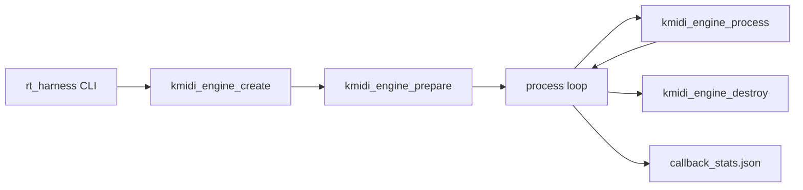

# Headless Engine and RT Harness

This repo supports a **headless** execution path for the KmiDi audio engine: no plugin UI, no DAW host, and no audio device. The engine lifecycle is driven directly by a small CLI that calls the C ABI (`kmidi_engine_*`), so you can run regression tests, measure real-time callback cost, and validate behavior without any GUI or host.

## What “headless” means here

- **No plugin UI** — no editor, no knobs, no windows.
- **No DAW host** — no VST/CLAP host, no session.
- **No audio device** — no system audio I/O; buffers are filled in-process.
- **Direct engine API** — create → prepare → process (in a loop) → destroy, with configurable sample rate, block size, and channel count.

This is the same engine that plugs into Tauri, plugins, or a future desktop app; headless mode exercises it in isolation for tests and metrics.

## RT harness (`rt_harness`)

The **rt_harness** executable is the headless driver. It:

1. Parses CLI options (duration, sample rate, block size, channels, output path).
2. Creates the engine, calls `kmidi_engine_prepare`, then runs a loop calling `kmidi_engine_process` for a given wall-clock duration.
3. Measures per-callback CPU time (microseconds) and writes P50/P90/P99 (and min/max/mean) to a JSON file (`callback_stats.json` by default).

Use it for:

- **Regression** — ensure the engine runs without crashing across block sizes and sample rates.
- **Latency checks** — fail CI if P90 callback time exceeds a threshold (e.g. `RT_HARNESS_P90_US_MAX=500`).
- **Reproducibility** — same config (e.g. 48 kHz, block 256, 2 ch) every time; see `rt_harness/fixtures/golden_preset.json`.

### Build

From repo root:

```bash
cmake -B build -G Ninja -DCMAKE_BUILD_TYPE=Release -DBUILD_RT_HARNESS=ON
cmake --build build --target rt_harness
```

`BUILD_RT_HARNESS` is **ON** by default (see [AGENTS.md](../AGENTS.md)). The target lives in [rt_harness/](../rt_harness/); it links only the `engine` library (no JUCE, no Qt).

### Run

```bash
./build/rt_harness/rt_harness --duration 30 --output callback_stats.json
```

Options:

| Option        | Meaning                          | Default        |
|---------------|----------------------------------|----------------|
| `--duration`  | Wall-clock run time (seconds)    | 30             |
| `--output`    | Output JSON path                 | callback_stats.json |
| `--sr`        | Sample rate                      | 48000          |
| `--block`     | Block size (samples)             | 256            |
| `--channels`  | Number of channels               | 2              |
| `--help` / `-h` | Print usage and exit          | —              |

Output JSON fields include `p50_us`, `p90_us`, `p99_us`, `min_us`, `max_us`, `mean_us`, `num_callbacks`, `duration_sec`, `buffer_size`, `sample_rate`.

### More detail

- [rt_harness/README.md](../rt_harness/README.md) — build, run, options, CI, golden preset.
- [docs/research/MULTIMODAL_IMPLEMENTATIONS_PLAN.md](research/MULTIMODAL_IMPLEMENTATIONS_PLAN.md) section 3.3 — design context for the harness.

## High-level flow



The harness drives the engine in a tight loop for a fixed duration, records each callback time, then writes stats and exits.

## Relation to other builds

| Build / target   | Role |
|------------------|------|
| **rt_harness**   | Headless driver; engine only, no UI. |
| **KellyFFI**     | Shared lib for Tauri/Rust; used by the app at runtime. |
| **KellyPlugin_VST3** / CLAP | Plugin builds; require JUCE UI. |

Headless does not replace the plugin or app; it is a separate, minimal path for testing and measuring the same engine.
