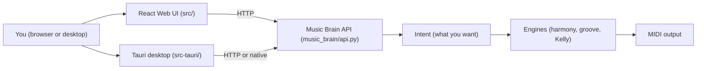

# KmiDi 101 — Overview

This module explains the KmiDi project in plain language. Each section names the real files and folders so you can find your way around.

---

## Section 0: What KmiDi Is (In One Page)

**KmiDi** is a music-making program that works from how you *feel*, not from a list of buttons.

You describe a feeling or a story in words. For example: "the feeling of losing someone but finding peace," or "something upbeat for a morning run." KmiDi turns that into music. It does not ask you to pick notes or beats by hand. It asks what you want the music to *do* for you, then builds the song from that.

Think of it like telling a chef "I want something warm and comforting" instead of reading a recipe line by line. The chef (here, KmiDi) decides the ingredients and the steps.

**What happens in practice:**

1. **You say what you want.** You describe the emotion or mood. Sometimes you add a few constraints (e.g. genre, key, instruments).
2. **KmiDi asks a few questions.** The system may "interrogate" your intent: it refines what you said into a clearer shape (core feeling, emotional map, technical choices). This is called "Interrogate Before Generate."
3. **KmiDi generates music.** It builds chord progressions, melodies, bass lines, drums, and other parts. The result is **MIDI** — the standard way computers represent musical notes and timing. That MIDI can be played back, edited, or sent to other programs.
4. **The result is humanized.** KmiDi deliberately adds small imperfections (tiny timing shifts, light velocity changes) so the music sounds more like a person played it, not a perfect machine.

**Kelly** is the name of the AI companion inside the system. Kelly helps turn your words into those production choices and can suggest when to break strict musical "rules" for a rawer or more tense effect.

No code in this section — just the idea: **you describe a feeling; KmiDi turns it into music.**

---

## Section 1: The Big Picture — How the Pieces Fit

KmiDi is built in layers. Each layer has a job. They pass your request along until it becomes music.

**In simple terms:**

- **You** use either a **browser** (web page) or a **desktop app** (window on your computer).
- The **web UI** is built with **React** (a way to build interfaces) and lives in the folder **`src/`**. It talks to the Brain over the network (HTTP).
- The **desktop app** is built with **Tauri** (a way to wrap a web-style UI in a small, secure desktop window). Its code is in **`src-tauri/`**. It can talk to the Brain over HTTP, and optionally to a C++ engine for real-time audio.
- The **Music Brain** is a **Python** program. Its front door is the file **`music_brain/api.py`**. That is where your request lands. The Brain checks that your request has the right shape (the "Intent"), then passes it to the right internal "rooms" (harmony, groove, emotion, etc.).
- The **Intent** is the formal description of what you want: feeling, genre, key, structure (intro, verse, chorus…), instruments. One shared description is used everywhere (web, desktop, Python).
- The **engines** are the parts that do the actual work: chord progressions, drum patterns, bass lines, melodies, and so on. They live inside **`music_brain/`** (and optionally a C++ real-time engine in **`src_penta-core/`**).
- The **output** is **MIDI** — note and timing data that can be played or edited.

So the flow is: **You → (React or Tauri) → Music Brain API → Intent → Engines → MIDI.**

The next sections go through each of these pieces and name the exact files and functions.
