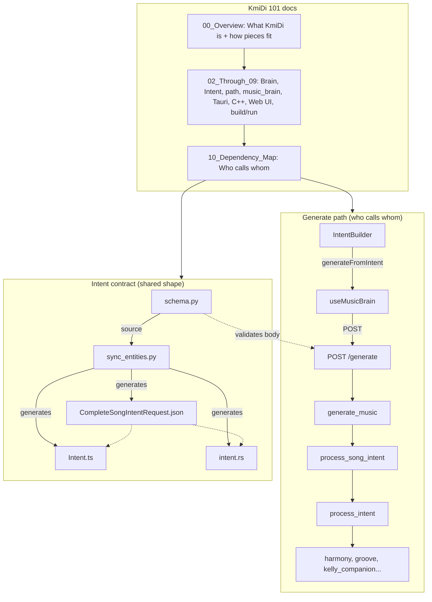
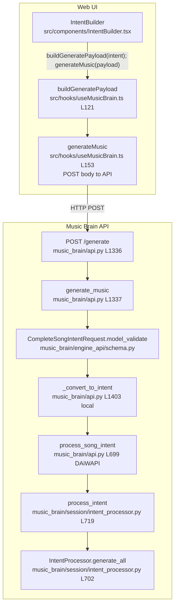
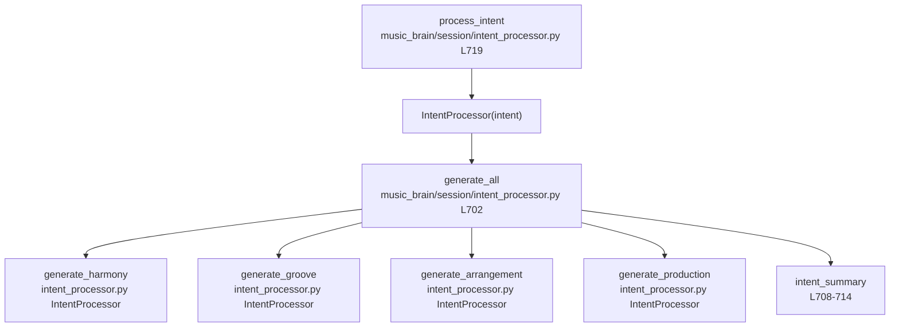
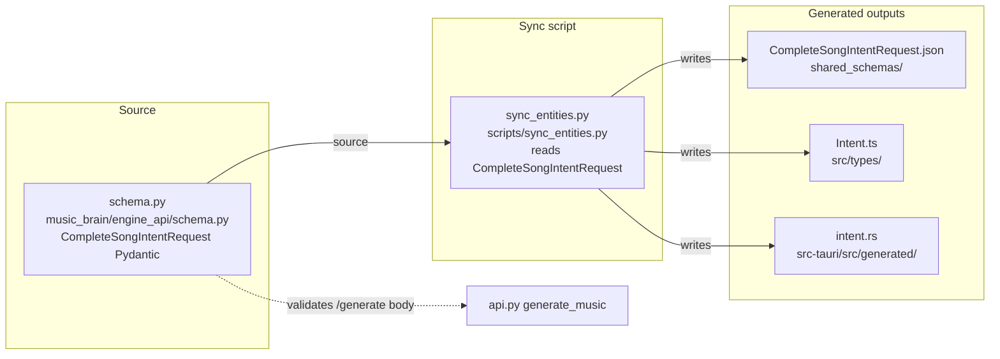

# KmiDi 101 — Course Module

Plain-language guide to the KmiDi project: what each part does, what depends on it, and how it ties together. Written for non-developers; uses real file and folder names.

## Contents

| File | Sections | Description |
| ---- | -------- | ----------- |
| [00_Overview.md](00_Overview.md) | 0–1 | What KmiDi is; how the pieces fit (big picture). |
| [02_Through_09_By_Area.md](02_Through_09_By_Area.md) | 2–9 | Brain, Intent, generate path, music_brain folders, Tauri, C++ engine, Web UI, build and run. |
| [10_Dependency_Map.md](10_Dependency_Map.md) | 10 | Who calls whom (main generate path and intent contract). |
| [11_Handoff.md](11_Handoff.md) | 11 | How to extend the 101 and pass the baton to the next writer/session. |
| [DISCOVERY_WORKFLOW.md](DISCOVERY_WORKFLOW.md) | — | How to find "what depends on X" and update the dependency map. When using the Cursor rule for dependency discovery, follow this workflow. |
| [KmiDi_101_NotebookLM_MindMap.md](KmiDi_101_NotebookLM_MindMap.md) | — | Hierarchy-only source for NotebookLM: upload to a notebook and ask for a **Mind Map** to get a branching overview of docs, generate path, and intent contract. |
| [KmiDi_101_Concatenated_MindMap.md](KmiDi_101_Concatenated_MindMap.md) | — | Single consolidated mind map (unified diagram + node → project file mapping); concatenates the NotebookLM views and links each node to repo files. |

### Combined map: docs, generate path, intent contract

Below, each process action is elaborated at file and code level; expand by scrolling to the next level.

### Level 1 — Generate path (file and code level)

### Level 2 — process_intent expanded (file and code level)

### Level 3 — Intent contract (file and code level)

Read in order for a full pass, or jump to a section by area (2–9) or the dependency map (10).
