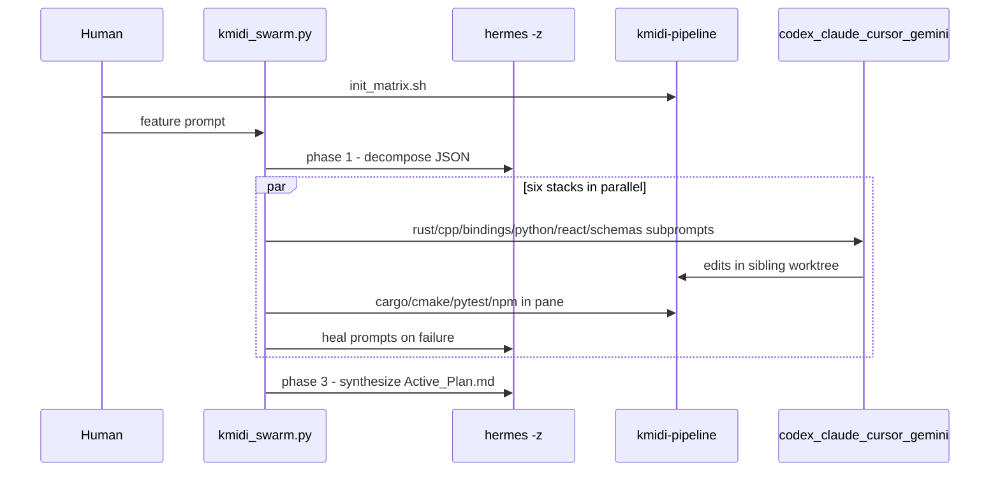

# Hermes Tmux Matrix — operator guide

The KmiDi multi-stack swarm orchestrates six specialist CLIs against a sibling
git worktree, conducted by a single Hermes Agent. This doc is the operator's
quick reference for the two-command workflow.

- Bootstrap script: [`scripts/init_matrix.sh`](../scripts/init_matrix.sh) (delegates to [`scripts/kmidi-pipeline-tmux.sh`](../scripts/kmidi-pipeline-tmux.sh))
- Orchestrator: [`scripts/kmidi_swarm.py`](../scripts/kmidi_swarm.py)
- Backbone brain: `hermes` CLI (≥ 0.14)

## Quick start

```bash
# Terminal A (iTerm2 or any terminal): start the tmux matrix.
# Creates session `kmidi-pipeline` with 7 windows (overview, schemas, rust,
# cpp, bindings, brain, react). Attaches if it already exists.
./scripts/init_matrix.sh

# Terminal B (any pane in the session, or any other terminal): run the swarm.
# The swarm doesn't care which window/pane you launch from — it only requires
# that `kmidi-pipeline` exists somewhere.
python3 scripts/kmidi_swarm.py "your multi-stack feature"
```

Dry run (phase 1 only, prints the JSON decomposition and exits; safe to use
without an active tmux session — useful right after `hermes update`):

```bash
python3 scripts/kmidi_swarm.py --dry-run "smoke test decomposition"
```

## Prerequisites

| Tool | Min version | Purpose |
|------|-------------|---------|
| `tmux` | any modern | Multiplexer for the matrix |
| `hermes` | 0.14 | Conductor (decompose / heal / synthesize) |
| `codex` *or* `claude` | current | Rust executor (codex preferred) |
| `claude` *or* `cursor-agent` | current | C++ / bindings / Python executors |
| `cursor-agent` *or* `claude` | current | React executor |
| `gemini` | current | Schema mapping (one-shot) |
| `cmake` + `ninja` | 3.27+ | C++ and bindings build gates |
| `cargo` | stable | Rust build gate |
| `python3` + `pip install -e .` | 3.11+ | Python lint/test gate |
| `npm install` already done | Node 20+ | React build gate |

You need at least one CLI per role; the orchestrator falls back to the
secondary if the primary fails three times (AMNESIA RESET, see below).

## Architecture at a glance



### Window / pane contract

Window indices are part of the contract between the bootstrap script and the
orchestrator. Do not renumber without updating both sides.

| Stack | Window | Pane | Build gate |
|-------|--------|------|------------|
| overview | 0 | 0 | status echoes only (`[hermes] ...`) |
| schemas | 1 | 0 | gemini-written `Obsidian_Vault/01_Context/schemas.md` (no compile) |
| rust | 2 | 0 | `cargo check` in `engine/intent_ir` |
| cpp | 3 | 0 | `cmake --build build --target KellyCore` |
| bindings | 4 | 0 | `cmake --build build --target penta_core_native` |
| python | 5 | 0 | `flake8 music_brain/` + `pytest tests/unit -q` |
| react | 6 | 1 | `npm run build` (bottom pane; top pane has banner) |

The matrix bootstrap also sets `CI=true`, `GIT_TERMINAL_PROMPT=0`, `PAGER=cat`,
etc. globally on the session so manual panes match the swarm's executor
environment.

## Worktree

The swarm always edits a **sibling** of the repo, not the repo itself:

| Path | Branch |
|------|--------|
| `~/Dev/kmidi-agent-workspace` | `feature/agent-swarm` |

This is anchored to `REPO_ROOT` (derived from `__file__` in
[`scripts/kmidi_swarm.py`](../scripts/kmidi_swarm.py)) so launching the swarm
from any cwd lands the worktree in the same place. All build gates run
`cd $WORKTREE && ...` so panes can stay at their convenience cwds.

## What to watch

- **Window 0 overview**: every `[hermes] phase N/3: ...` line is one Hermes
  phase boundary (`decompose`, `parallel execute`, `synthesize`).
- **Stack panes**: live build output. The swarm waits for each pane to be
  *unchanged for 6 s* before scanning for errors, so slow `cmake`/`npm`
  finishes are no longer flagged as false "build CLEAN".
- **AMNESIA RESET line**: after three failures on a stack, the orchestrator
  swaps to the fallback CLI, runs `git checkout -- .` in the pane, and clears
  failure history before the final attempt.

## Outputs (per swarm run)

Inside the worktree:

| File | Content |
|------|---------|
| `Obsidian_Vault/Master_Plans/Active_Plan.md` | Hermes-written run summary |
| `Obsidian_Vault/01_Context/schemas.md` | gemini-written cross-language schema map |

The swarm never auto-commits. Human reviews the diff on
`feature/agent-swarm` and cherry-picks or opens a PR.

## Hermes maintenance

```bash
hermes update              # latest CLI
hermes doctor              # config + dependency check
hermes auth                # provider credential pool
hermes -z "OK" --yolo --accept-hooks   # smoke-test the swarm's one-shot mode
```

Validate the orchestrator after any `hermes update`:

```bash
python3 scripts/kmidi_swarm.py --dry-run "add a no-op field to IntentFrame"
```

## Troubleshooting

| Symptom | Likely cause / fix |
|---------|--------------------|
| `ERROR: tmux session 'kmidi-pipeline' is not running` | Run `./scripts/init_matrix.sh` first |
| `hermes returned non-JSON ...` during decompose | Run `hermes doctor`; consider `--dry-run` to inspect raw output |
| Stack stays in failed state through AMNESIA RESET | Open the pane manually, run the build cmd, fix by hand, and re-run the swarm with a tighter prompt |
| Worktree path conflicts with existing branch | `git worktree remove` the stale entry, or delete `~/Dev/kmidi-agent-workspace` and rerun |
| pybind11 / `penta_core_native` build error | Check `bindings/` cautions in [`AGENTS.md`](../AGENTS.md) (JUCE / ODR / allocator notes) |

## Related docs

- [`AGENTS.md`](../AGENTS.md) — full FFI / RT / JUCE rules (read before native edits)
- [`docs/DEVELOPMENT.md`](DEVELOPMENT.md) — general dev workflows
- [`docs/FULL_STACK_BUILD.md`](FULL_STACK_BUILD.md) — manual end-to-end build path
