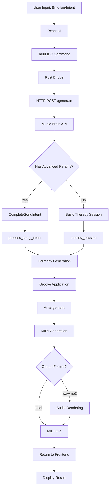
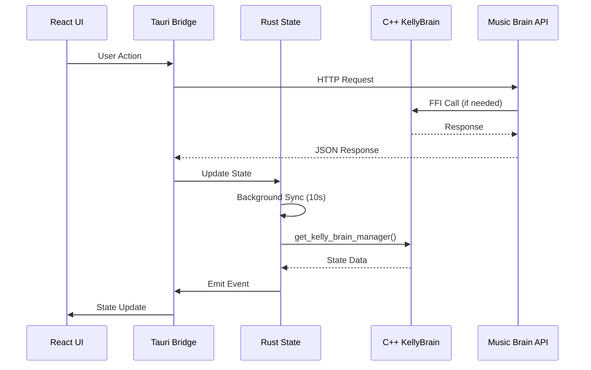
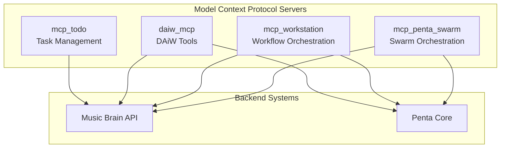
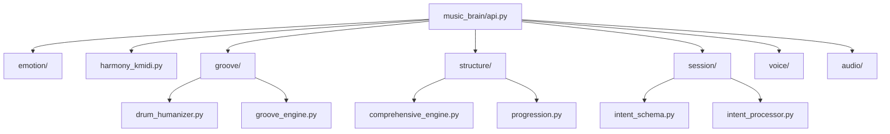
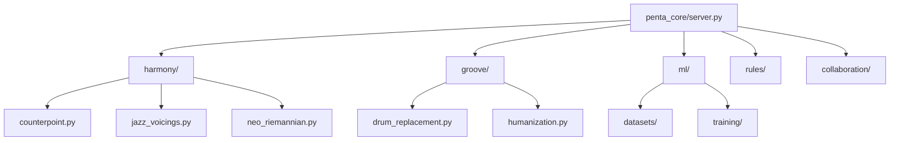
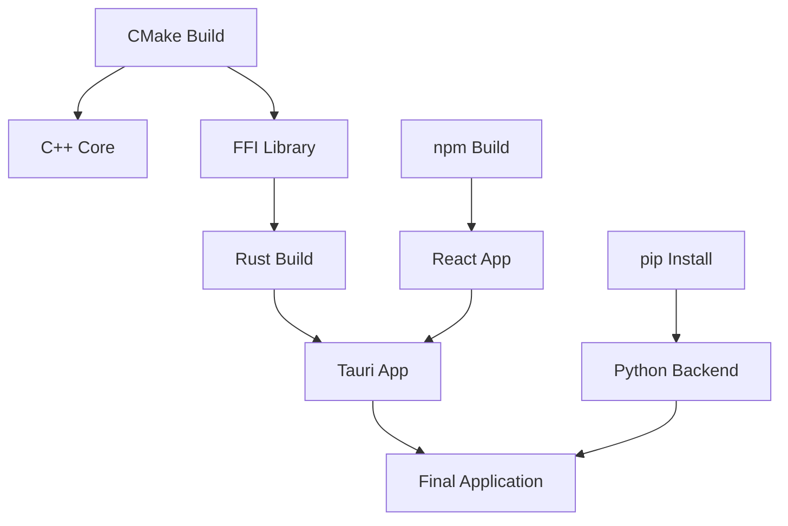

# KmiDi System Architecture

**Date**: 2026-01-21  
**Status**: Complete Architecture Documentation

This document provides a comprehensive view of the KmiDi system architecture, including data flows, integration points, and system relationships.

## Architecture Overview

KmiDi is a multi-layered system with the following architecture:

```
┌─────────────────────────────────────────────────────────────┐
│                    Frontend Layer (React)                    │
│  ┌──────────────┐  ┌──────────────┐  ┌──────────────┐     │
│  │   Emotion    │  │    Intent    │  │ SpectoCloud  │     │
│  │   Selection  │  │   Injection  │  │ Visualization│     │
│  └──────────────┘  └──────────────┘  └──────────────┘     │
└──────────────────────┬──────────────────────────────────────┘
                       │ Tauri IPC
┌──────────────────────▼──────────────────────────────────────┐
│              Desktop Bridge (Rust/Tauri)                     │
│  ┌──────────────┐  ┌──────────────┐  ┌──────────────┐     │
│  │   State      │  │    Events    │  │   FFI        │     │
│  │  Management  │  │   Handling   │  │   Bridge     │     │
│  └──────────────┘  └──────────────┘  └──────────────┘     │
└──────────┬──────────────────┬──────────────────────────────┘
           │ HTTP/REST         │ FFI (dylib)
┌──────────▼──────────┐  ┌────▼──────────────────────────────┐
│   Backend APIs       │  │   C++ Core Engine                 │
│  ┌────────────────┐ │  │  ┌────────────────────────────┐   │
│  │ Music Brain    │ │  │  │  KellyBrain Engine          │   │
│  │ API (FastAPI)  │ │  │  │  - Intent Processing       │   │
│  └────────────────┘ │  │  │  - Emotion Mapping         │   │
│  ┌────────────────┐ │  │  │  - MIDI Generation         │   │
│  │ Penta Core     │ │  │  └────────────────────────────┘   │
│  │ Server         │ │  │  ┌────────────────────────────┐   │
│  └────────────────┘ │  │  │  DSP Core                  │   │
│  ┌────────────────┐ │  │  │  - Audio Processing       │   │
│  │ MCP Servers    │ │  │  │  - Filters                 │   │
│  │ (4 servers)    │ │  │  └────────────────────────────┘   │
│  └────────────────┘ │  └───────────────────────────────────┘
└──────────────────────┘
```

## System Layers

### Layer 1: Frontend (React + Tauri)

**Purpose**: User interface and interaction

**Components**:
- React UI components
- Tauri window management
- State management hooks
- API communication

**Technologies**:
- React 19.1
- TypeScript 5.8
- Tailwind CSS 4
- Tauri 2.0

**Key Files**:
- `src/App.tsx` - Main application
- `src/components/` - UI components
- `src/hooks/` - React hooks

### Layer 2: Desktop Bridge (Rust)

**Purpose**: Bridge between frontend and backend systems

**Components**:
- Tauri IPC commands
- State synchronization
- Event management
- FFI interface to C++

**Technologies**:
- Rust
- Tauri 2.0
- reqwest (HTTP client)

**Key Files**:
- `src-tauri/src/main.rs` - Entry point
- `src-tauri/src/state.rs` - State management
- `src-tauri/src/events.rs` - Event handling

### Layer 3: Backend APIs (Python)

**Purpose**: Business logic and music generation

**Components**:
- Music Brain API (FastAPI)
- Penta Core Server
- MCP Servers

**Technologies**:
- Python 3.9+
- FastAPI
- uvicorn

**Key Files**:
- `music_brain/api.py` - Main API server
- `penta_core/server.py` - Theory server
- `mcp_*/server.py` - MCP servers

### Layer 4: Core Engine (C++)

**Purpose**: Low-level music processing

**Components**:
- KellyBrain engine
- Intent processing pipeline
- MIDI generation
- DSP processing

**Technologies**:
- C++20
- CMake
- Optional: JUCE

**Key Files**:
- `src/engine/KellyBrain.cpp` - Main engine
- `src/bridge/kelly_ffi.cpp` - FFI layer
- `src/dsp/` - DSP core

## Data Flow Diagrams

### Primary Generation Flow



### State Synchronization Flow



### MCP Server Architecture



## Integration Points

### 1. Frontend ↔ Backend

**Protocol**: HTTP REST API  
**Port**: 8000  
**Endpoints**:
- `GET /emotions` - List emotions
- `POST /generate` - Generate music
- `POST /interrogate` - Refine intent
- `POST /spectocloud/render` - Render visualization

**Data Format**: JSON

### 2. Rust ↔ C++

**Protocol**: FFI (Foreign Function Interface)  
**Library**: `libKellyFFI.dylib` (macOS)  
**Location**: `src-tauri/resources/` (after build)

**Key Functions**:
- `get_kelly_brain_manager()` - Get brain manager
- `with_brain()` - Execute with brain context
- `is_initialized()` - Check initialization

### 3. Python ↔ C++

**Protocol**: Direct FFI calls (via Python bindings)  
**Location**: `src/python/bindings.cpp`

**Note**: Currently minimal, most communication via API

### 4. MCP Servers ↔ Backend

**Protocol**: Model Context Protocol  
**Integration**: Direct Python imports

**Servers**:
- `mcp_penta_swarm` - Uses music_brain, penta_core
- `mcp_workstation` - Uses music_brain, penta_core
- `daiw_mcp` - Uses music_brain tools
- `mcp_todo` - Uses music_brain

## Component Relationships

### Music Brain Module Dependencies



### Penta Core Module Dependencies



## Build Architecture

### Build Dependencies



### Build Order

1. **C++ Core** (CMake)
   - Build KellyBrain engine
   - Build FFI library (`libKellyFFI.dylib`)
   - Copy to `src-tauri/resources/`

2. **Rust Bridge** (Cargo)
   - Build Tauri application
   - Link against FFI library
   - Generate Tauri bundle

3. **Python Backend** (pip)
   - Install dependencies
   - No build step (interpreted)

4. **Frontend** (npm)
   - Install dependencies
   - Build React app
   - Bundle with Vite

5. **Integration**
   - Copy FFI library to Tauri resources
   - Bundle all components

## Runtime Architecture

### Process Structure

```
┌─────────────────────────────────────────┐
│         Desktop Application             │
│  ┌───────────────────────────────────┐  │
│  │  Tauri Window (React UI)          │  │
│  │  - Main Process                   │  │
│  └───────────────────────────────────┘  │
│  ┌───────────────────────────────────┐  │
│  │  Rust Backend                      │  │
│  │  - State Management               │  │
│  │  - Background Tasks                │  │
│  │  - FFI Interface                   │  │
│  └───────────────────────────────────┘  │
└─────────────────────────────────────────┘
           │ HTTP (port 8000)
┌──────────▼──────────────────────────────┐
│      Python Backend Process             │
│  ┌───────────────────────────────────┐  │
│  │  Music Brain API (uvicorn)         │  │
│  │  - FastAPI Server                  │  │
│  │  - Request Handling               │  │
│  └───────────────────────────────────┘  │
│  ┌───────────────────────────────────┐  │
│  │  Music Brain Modules               │  │
│  │  - Emotion Processing              │  │
│  │  - Harmony Generation              │  │
│  │  - Groove Processing               │  │
│  │  - Structure Analysis              │  │
│  └───────────────────────────────────┘  │
└─────────────────────────────────────────┘
           │ FFI (dylib)
┌──────────▼──────────────────────────────┐
│      C++ Core Library                    │
│  ┌───────────────────────────────────┐  │
│  │  libKellyFFI.dylib                │  │
│  │  - KellyBrain Engine               │  │
│  │  - Intent Processing               │  │
│  │  - MIDI Generation                │  │
│  └───────────────────────────────────┘  │
└─────────────────────────────────────────┘
```

## Security Architecture

### Tauri Security

- **IPC**: Whitelisted commands only
- **File System**: Restricted access
- **Network**: CORS configured for localhost

### API Security

- **CORS**: Configured for localhost:1420 (Tauri dev)
- **Input Validation**: Pydantic models
- **Error Handling**: Structured error responses

## Performance Considerations

### Real-Time Requirements

- **DSP**: Must be real-time safe (no allocations)
- **UI Updates**: Throttled to prevent blocking
- **State Sync**: 10-second intervals (background)

### Memory Management

- **Model Loading**: Hot-swap capable
- **Memory Budgets**: Defined in `config/models.yaml`
- **Resident Models**: Always loaded (emotion, intent)
- **On-Demand Models**: Loaded when needed

## Extension Points

### Adding New MCP Servers

1. Create server in `mcp_*/` directory
2. Implement MCP protocol
3. Add to configuration
4. Document in system inventory

### Adding New DAW Integrations

1. Create module in `music_brain/daw/`
2. Implement DAW-specific interface
3. Add to API endpoints
4. Update documentation

### Adding New ML Models

1. Add model config to `config/models.yaml`
2. Implement model loader
3. Add to model registry
4. Update memory budgets

## References

- System Inventory: `docs/SYSTEM_INVENTORY.md`
- Architecture Details: `docs/ARCHITECTURE.md`
- Integration Guide: `KmiDi_FINAL_INTEGRATION_GUIDE.md`
- Gap Analysis: `FEATURE_GAP_ANALYSIS.md`
