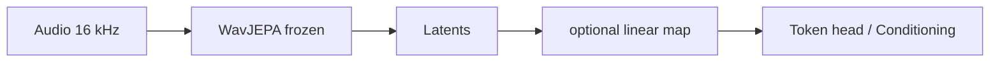

# WavJEPA latent pipeline (design)

**Purpose:** Define where a **frozen** WavJEPA (or any JEPA-style audio encoder) sits in the MIDI/latent pipeline without breaking determinism. No training of the encoder.

**Related:** [UMP_JEPA_EXPRESSIVE_CONDITIONING.md](UMP_JEPA_EXPRESSIVE_CONDITIONING.md), [apple-silicon-low-latency.md](apple-silicon-low-latency.md), [mt3-transcription-baseline.md](mt3-transcription-baseline.md).

---

## Placement

- **Input:** Raw or preprocessed audio (16 kHz, fixed chunk or streaming ~2 s).
- **Encoder:** Frozen WavJEPA context encoder (or target encoder) → one embedding vector per time step (e.g. 100 Hz).
- **Downstream:** Latents → optional linear map → token head (MT3-style / REMI) or UMP/JEPA conditioning as in [UMP_JEPA_EXPRESSIVE_CONDITIONING.md](UMP_JEPA_EXPRESSIVE_CONDITIONING.md) (e.g. control bias into a *separate* context encoder that sees note/control, not raw audio).

---

## Pipeline diagram



ASCII:

```
Audio (16 kHz, 2 s) → WavJEPA (frozen) → latents → [optional: linear map] → token head / conditioning
```

---

## Determinism

- **Frozen encoder + fixed preprocessing** (resample to 16 kHz, norm; no randomness at inference) ⇒ same audio in ⇒ same latent sequence out.
- **No EMA or stochastic masking at inference;** teacher/target encoder used only as a fixed feature extractor.
- Any “contract” (e.g. “this latent band = intensity”) is defined *after* the frozen encoder (e.g. via a fixed linear map or a small frozen adapter), not by the encoder’s internal geometry.

---

## Where it does *not* go

- Do **not** train the WavJEPA predictor or target encoder in the KmiDi stack; that would re-open geometry drift.
- Use WavJEPA only as a **frozen feature extractor**.

---

## Optional: drift detector

- Use WavJEPA embeddings to detect divergence from an intended trajectory (e.g. compare embedding sequence to a reference).
- Determinism is preserved if the reference and the comparison metric are fixed (no learned or stochastic components in the comparison).
