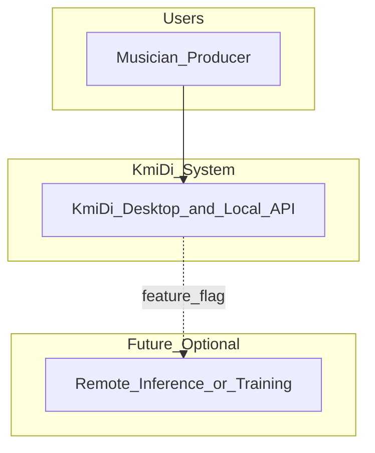
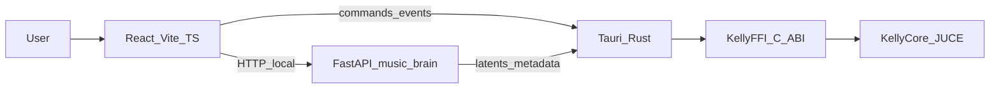
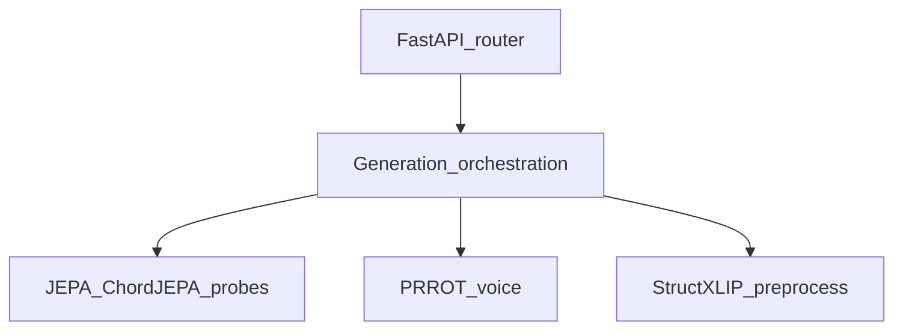
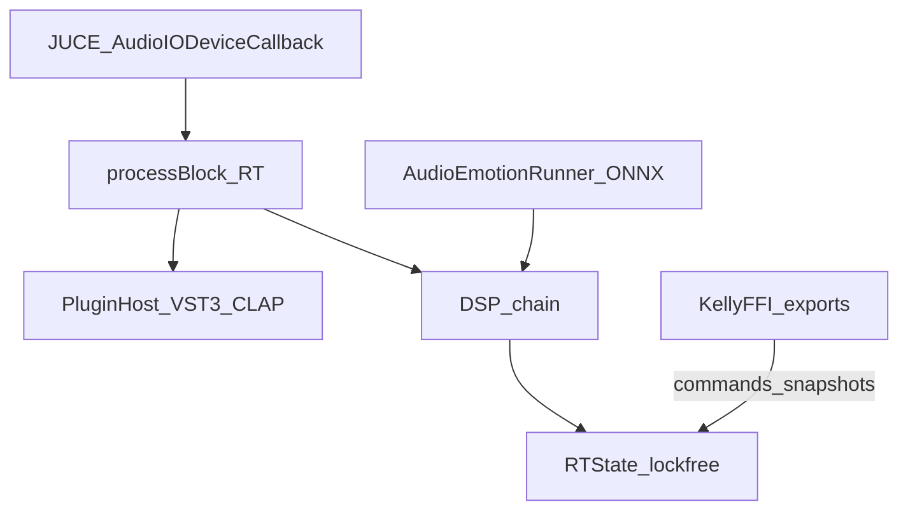
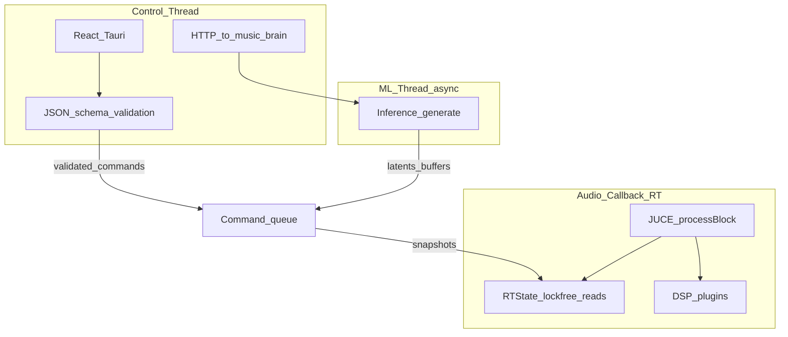
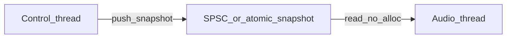
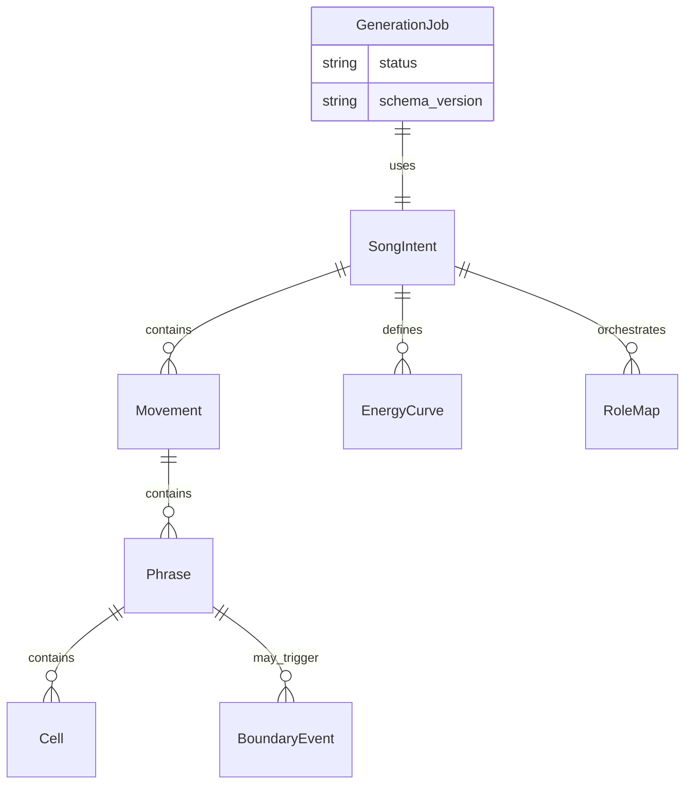
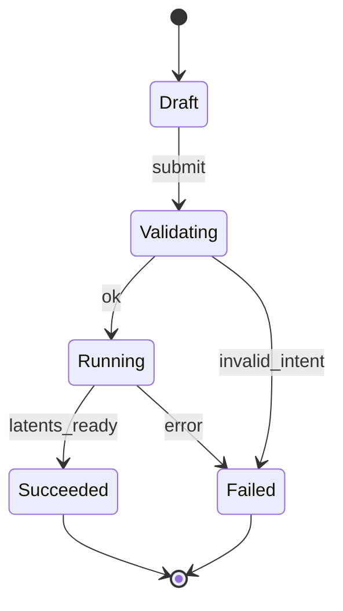
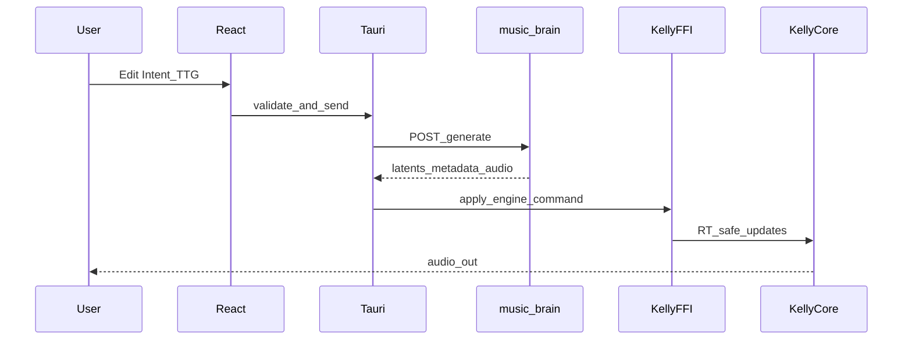

# KmiDi — Product Requirements Document (PRD)

| Field | Value |
|-------|--------|
| **Version** | 0.1 (draft) |
| **Status** | Architecture-first baseline |
| **Repository** | Canonical monorepo: `KmiDi/` |
| **Audience** | Engineering leads, senior ICs, ML/audio architects |

**Related:** [`AGENTS.md`](../../AGENTS.md), [`README.md`](../../README.md), [ADR 001 — one UI path](../adr/001-one-ui-path.md), [`docs/KMIDI_FINAL_MERGE_PLAN.md`](../KMIDI_FINAL_MERGE_PLAN.md).

---

## 1. Executive summary

### 1.1 Problem statement

KmiDi bridges **high-level web UI**, a **Rust (Tauri) desktop shell**, a **real-time C++/JUCE engine** (KellyCore, KellyFFI), and a **Python FastAPI ML service** (`music_brain`). The codebase has accumulated **unclear boundaries**, duplicate integration paths, and **structural intent** expressed as a **rigid flat list of sections**—a poor fit for modern electronic/pop production (micro-tension, fills, polymetric overlap, custom sections).

### 1.2 Product thesis

**Offline-first** desktop music creation: users define **Song Intent** (mood, genre, structure, orchestration); the **ML pipeline** (JEPA-family models, emotion probes, PRROT, StructXLIP) produces **latents and musical material**; the **native engine** renders **RT-safe audio** at sample rate, with **emotion-to-DSP** mapping (e.g. ONNX in `AudioEmotionRunner`) and **plugin hosting** (VST3/CLAP). Optional **remote** services are out of MVP scope unless behind feature flags.

### 1.3 Non-goals (MVP)

- Multi-tenant SaaS or mandatory cloud dependency.
- Replacing JUCE as the audio/plugin foundation in v1.
- Full microservices decomposition of the desktop deliverable.

---

## 2. Bounded contexts (DDD)

Each context has an **anti-corruption layer** at its boundary (schema validation, typed FFI, no raw JSON inside C++ without validation).

| Context | Responsibility | Primary artifacts |
|---------|----------------|-------------------|
| **Composition & Intent** | Song Intent, **Temporal Tension Graph (TTG)**, curves, roles | [`shared_schemas/`](../../shared_schemas/), synced TS / Rust / Python |
| **Shell & Platform** | Windowing, lifecycle, packaging, secure IPC | [`src-tauri/`](../../src-tauri/) |
| **FFI & Engine control** | KellyFFI C ABI, buffer lifetimes, versioned calls | Rust ↔ `libKellyFFI` |
| **Real-Time Audio Engine** | `processBlock`, DSP, plugins, **RTState** (lock-free) | `engine/`, `include/`, KellyCore |
| **ML & Inference** | `/generate`, training, JEPA, probes, PRROT, StructXLIP | [`music_brain/`](../../music_brain/) |
| **Model & Artifact registry** | Weights, ONNX/Core ML/ExecuTorch pins, configs | `config/`, `experiments/`, `KELLY_MODELS_PATH` |
| **Observability** | Logs, metrics, traces, PID flow, canonicalization tooling | Cross-cutting; Python API + native hooks |

**Aggregates (summary):**

- **Intent aggregate:** root intent document, schema version, TTG root node.
- **Generation job:** request id, status, outputs (latents, audio handles), errors.
- **Engine session:** transport state, non-RT command queue vs RT parameter snapshot.

---

## 3. Domain events (event storming catalog)

Events are **domain concepts**; transport may be REST, Tauri commands, or in-process callbacks.

| Event | Producer | Consumer | Payload owner |
|-------|----------|----------|----------------|
| `IntentDrafted` | Composition & Intent | UI persistence | Intent schema version |
| `IntentValidated` | Composition & Intent | Shell / Brain | Same |
| `IntentSubmittedToBrain` | Shell | ML & Inference | `GenerateRequest` / API types |
| `GenerationJobStarted` | ML & Inference | Shell, UI | Job id |
| `LatentBundleReady` | ML & Inference | Shell, Engine (via FFI) | Versioned buffers + metadata |
| `GenerationFailed` | ML & Inference | Shell, UI | Error model |
| `EngineParametersUpdated` | ML / mapping layer | Real-Time Engine | RT-safe snapshot |
| `PlaybackStateChanged` | Real-Time Engine | UI (observers) | Transport position, state |
| `PluginLoaded` | Real-Time Engine | UI | Plugin id, format |
| `RealtimeConstraintViolated` | Tests / harness | Dev observability | Assertion context |

---

## 4. Architecture style: hybrid modular monolith

**Recommendation:** Treat the **shipping product** as a **modular monolith**: one desktop app (Tauri + embedded or local **single** `music_brain` process) and **one** native audio engine library. **Internal** modules mirror bounded contexts; **physical** splitting into many network services is deferred until remote inference or training clusters justify it.

**Rationale:** Extra deployables increase FFI surface, versioning pain, and ops cost without improving latency for local RT audio.

**Phase 2 (optional):** Remote brain via **gRPC or REST** behind a **feature flag**; **Protobuf** only if strict binary contracts or multi-language clients require it.

### 4.1 C4 Context



### 4.2 C4 Container



### 4.3 Component sketch — `music_brain` (illustrative)



### 4.4 Component sketch — KellyCore (illustrative)



---

## 5. Communication patterns

| Link | Pattern | Payload |
|------|---------|---------|
| React ↔ Tauri | Tauri commands / events | Typed structs; JSON where needed |
| React ↔ `music_brain` | **HTTP REST** (local), OpenAPI at `/docs` | JSON |
| Tauri ↔ KellyCore | **FFI** (C ABI), documented structs | Buffers + versioned metadata |
| Domain design | **Event language** (section 3) | Logical; no mandatory message bus in v1 |

**Principle:** Use **event-storming events** for requirements and traces; **implement** with commands/REST/FFI until a bus is warranted.

---

## 6. Data ownership

| Data | Owner | Notes |
|------|--------|------|
| Intent / TTG JSON | Composition & Intent | [`shared_schemas/CompleteSongIntentRequest.json`](../../shared_schemas/CompleteSongIntentRequest.json); sync via `scripts/sync_entities.py` |
| HTTP `/generate` payload | ML & Inference | `GenerateRequest` / `EmotionalIntent` in `music_brain/api.py` (distinct from strict engine schema — see AGENTS) |
| Engine boundary schema | ML & Engine | `music_brain/engine_api/schema.py` — `CompleteSongIntentRequest` strict form |
| Generation artifacts | ML & Inference | Engine receives **consumable** tensors/buffers, not raw checkpoints |
| RT playback state | Real-Time Engine | Python **never** writes RT memory directly |
| Embeddings / vector indexes | Model & Artifact registry | **Canonicalization** when encoders change (`fit_orthogonal_map` / `apply_map`) |

---

## 7. API contracts and versioning

- **OpenAPI:** Maintain `/generate` and related endpoints as first-class; keep [`tests/unit/test_api_schema.py`](../../tests/unit/test_api_schema.py) aligned.
- **REST versioning:** Prefer `/v1/...` or explicit version headers for breaking changes.
- **Intent IR:** Every document carries **`intent_schema_version`** (or equivalent) for TTG migrations.
- **FFI:** Versioned symbols; document struct layout, alignment, and buffer ownership (Rust mediates; no JS → C++ raw pointers).

**Message formats:** JSON at UI and HTTP boundaries today. **Protobuf** / gRPC as a **Phase 2** decision trigger: multiple remote clients, bandwidth constraints, or strict binary compatibility requirements.

---

## 8. Temporal Tension Graph (TTG)

### 8.1 Limits of the current flat `structure` model

The existing API expects `technical.structure` as a list of blocks with `name` in `intro|verse|chorus|bridge|outro|build|drop` and `bars` (see AGENTS). This is insufficient when:

1. **Micro-tension** matters (e.g. one-bar drum fill before a section change).
2. **Energy/intensity curves** should drive generation, not only section labels.
3. **Polymetric / overlapping phrases** (e.g. vocal overlap across barlines) are required.
4. **Custom section identities** are required beyond the fixed enum.

### 8.2 TTG concept

- **Hierarchical time:** **Movements** (macro) → **Phrases** (meso) → **Cells** (micro).
- **First-class curves:** **Energy**, **tension**, **harmonic rhythm** as functions over musical time (bars/beats/samples), not only tags.
- **Boundary events:** Operators between regions (e.g. `drum_fill_1bar`, `riser`, `drop_out`, `silence_gap`, `metric_modulation`)—not the same as “sections.”
- **Role-based orchestration:** Map **musical roles** (sub_bass, arp, lead_vocal) to patches and **activation thresholds** on energy/density curves—not flat global instrument lists.

### 8.3 Normative example (illustrative JSON)

```json
{
  "timeline": {
    "type": "movement",
    "id": "A",
    "bars": 16,
    "children": [
      {
        "type": "phrase",
        "bars": 8,
        "harmonic_rhythm": "slow",
        "motifs": ["motif_alpha"]
      },
      {
        "type": "phrase",
        "bars": 8,
        "harmonic_rhythm": "fast",
        "boundary_event": "drum_fill_1bar"
      }
    ]
  }
}
```

```json
{
  "orchestration": {
    "roles": {
      "sub_bass": { "patch": "808_clean", "active_threshold": 0.5 },
      "arp_synth": { "patch": "juno_106", "active_threshold": 0.2 },
      "lead_vocal": { "patch": "prrot_voice_1", "active_threshold": 0.1 }
    }
  }
}
```

### 8.4 Migration strategy

| Version | Description |
|---------|-------------|
| **v0** | Flat `structure[]` + fixed section names (current `/generate` contract) |
| **v1 TTG** | Tree timeline + curves + boundary events + roles (subset for MVP) |

**Rules:** Adapters **from v0 → v1** for backward compatibility; deprecation window for v0 documented in release notes; schema sync pipeline must regenerate TS/Rust/Python on every change.

---

## 9. Real-time engineering hazards and mathematical boundaries

These requirements explain why TTG data crosses **validation → Rust → C++** in a strict order and why **RTState** uses **lock-free** updates.

### 9.1 Audio thread “click and pop” (RT-safety)

Continuous audio (~48 kHz) requires **no mutexes, blocking, or heap allocation** on the audio callback path when reading energy/tension targets. Failure modes: priority inversion, missed deadlines, clicks/pops, dropouts, unstable plugin hosts.

**Requirement:** Non-negotiable split between **control thread** (intent edits, network, allocation) and **audio thread** (lock-free reads, fixed work). Align with existing **`RTState` atomics** and integration gate: *no heap allocations or locks on RT paths* ([`AGENTS.md`](../../AGENTS.md)).

### 9.2 Interpolation and “zippering”

Energy curves (e.g. 0.1 → 0.9 over 16 bars, exponential) must be evaluated **smoothly** at **audio-rate or scheduled parameter ticks**, not only on UI frames. Stair-stepped updates cause **zippering** on filters and gains.

**Requirement:** Closed-form or **piecewise** coefficients; denormal handling; optional smoothing for parameter slews; **microbenchmark** curve evaluation on RT paths.

### 9.3 Serialization boundary (FFI safety)

Nested TTG graphs from JSON must be **schema-validated** in TypeScript/Python **before** native parsing. Rust should deserialize into **fixed layouts** where possible. C++ must not assume string/array shapes without checks—**UB and segfaults** otherwise.

**Requirement:** Reject malformed intent with explicit errors; versioned structs; no silent coercion in C++.

### 9.4 Tension vs latent space

JEPA-style models operate in **high-dimensional latents**, not user labels. Naive 1D→N-D mappings produce **chaotic** or incoherent output during builds.

**Requirement:** A documented **conditioning contract**: how curves and boundary events become **control vectors**, **schedules**, or **interpolated** conditioning (manifold, learned mapper, or discrete timetable)—with **testable** smoothness and ablation hooks.

### 9.5 Mandatory cross-cutting patterns

| Pattern | Use |
|---------|-----|
| **Observer / reactive UI** | Intent editor, meters—off audio thread |
| **Lock-free SPSC / snapshots** | Control → audio parameter handoff (complements atomics) |
| **ECS or explicit graph** | TTG hierarchy and boundary operators |
| **Strict KellyFFI ABI** | Versioned entry points, buffer lifetimes, Rust as sole bridge from web |

### 9.6 Threading and RT model



### 9.7 Parameter handoff (optional detail)



---

## 10. Non-functional requirements and risks

| NFR | Target / note |
|-----|----------------|
| On-device inference | Research target **&lt;15 ms/token** on Apple M4-class hardware for specified Core ML/ExecuTorch paths — measure via dedicated benchmarks, not assumed |
| Latency | Local REST to `music_brain`; minimize cold start via packaging and lazy model load |
| RT safety | See §9; ASan/UBSan clean debug builds per integration gate |

### 10.1 Risk register and mitigations

| Risk | Impact | Mitigation |
|------|--------|------------|
| Schema drift UI/Python/Rust | Silent contract breaks | `sync_entities.py` + CI schema tests |
| ONNX / emotion pipeline latency | Glitchy mapping | Benchmark `AudioEmotionRunner`; async where safe |
| Python cold start | Slow first generation | Packaged brain, preload, lazy imports |
| Large model I/O | Disk/memory pressure | Artifact registry, streaming load, pins |
| Flat vs TTG mismatch | Product/tech debt | v0→v1 adapter, phased UI |
| Duplicate UI / merge debt | Confusion | ADR 001; single tree; [`KMIDI_FINAL_MERGE_PLAN.md`](../KMIDI_FINAL_MERGE_PLAN.md) |
| FFI misuse | Crashes | Rust-only native boundary; fuzz JSON round-trips |

**Spikes / POCs:** RT curve microbench; Intent JSON → native round-trip tests; bundled API startup time; KellyFFI buffer lifetime audit.

---

## 11. Engineering quality (phased)

Aspirational “North Star” bars (strict line limits, **85%** coverage, cyclomatic **≤10**, `mypy --strict`, `clang-tidy`, warnings-as-errors) apply **incrementally**:

| Phase | Focus |
|-------|--------|
| **A** | TS checks, formatters, schema drift CI, flake8 on `music_brain/` |
| **B** | `mypy` tightening, `clang-tidy` on FFI/engine, coverage on **intent + API + FFI** |
| **C** | Full numeric targets once test harness and refactors stabilize |

---

## 12. DevOps: branching, CI/CD, observability

- **Branching:** **Trunk-based** with short-lived feature branches; release branches only if signing/App Store workflows require.
- **CI:** Matrix covering **Node** (`npm ci`, `tsc`, build), **Python** (`flake8`, `pytest`), **Rust** (`cargo test`), **CMake** targets as applicable; artifact: installer + packaged brain where applicable.
- **Rollback:** Versioned releases + **model artifact pins**; reproducible builds from lockfiles.
- **Logging:** Structured logs (JSON) from FastAPI; Rust `RUST_LOG`; avoid hot-path logging in audio callbacks.
- **Metrics:** Prometheus-compatible endpoints or sidecar **optional** for `music_brain`.
- **Tracing:** OpenTelemetry **Phase 2** for distributed debugging when remote services exist.
- **Alerting:** Generation failure rate, crash-free sessions, schema validation failures (server-side).

---

## 13. MVP scope, milestones, feature flags

**MVP:** End-to-end **Intent → `/generate` → engine playback** with **TTG v1 subset**: movements + phrases + **one** boundary event type + **role thresholds** on energy.

| Milestone | Deliverable |
|-----------|-------------|
| M1 | TTG v1 schema + `sync_entities.py` + tests |
| M2 | Intent UI for TTG subset |
| M3 | Engine mapping + RT-safe parameters |
| M4 | Emotion probe accuracy iteration |

**Feature flags (default off):** Remote brain, experimental TTG operators, cloud training, gRPC brain.

---

## 14. Entity relationship (conceptual)



---

## 15. Generation job state machine



---

## 16. Data flow (swimlane)



---

## 17. References

| Document | Purpose |
|----------|---------|
| [`AGENTS.md`](../../AGENTS.md) | Schema sync, `/generate` vs engine schema, StructXLIP, PID flow, integration gate |
| [`README.md`](../../README.md) | V1 pipelines (PyInstaller + Tauri vs KellyFFI full stack) |
| [ADR 001 — one UI path](../adr/001-one-ui-path.md) | Canonical Tauri + React; deprecated UI surfaces |
| [`docs/DEVELOPMENT.md`](../DEVELOPMENT.md) | Dev workflows |
| [`docs/FULL_STACK_BUILD.md`](../FULL_STACK_BUILD.md) | Full-stack build order |
| [`docs/KMIDI_FINAL_MERGE_PLAN.md`](../KMIDI_FINAL_MERGE_PLAN.md) | Merge strategy from KmiDi_FINAL; avoid duplicate UIs |

---

## Appendix A — North Star quality bars (optional targets)

| Area | Bar (when enforced) |
|------|---------------------|
| C++ | `-Wall -Wextra -Werror`, `clang-tidy` |
| Python | `flake8`, `mypy --strict` on critical packages |
| TypeScript | `strict: true`, ESLint |
| Tests | High coverage on boundary code; edge and failure tests |
| Complexity | Cyclomatic complexity limits on new code |

These are **goals**, not day-one blockers for research-heavy paths; align with §11 phasing.
